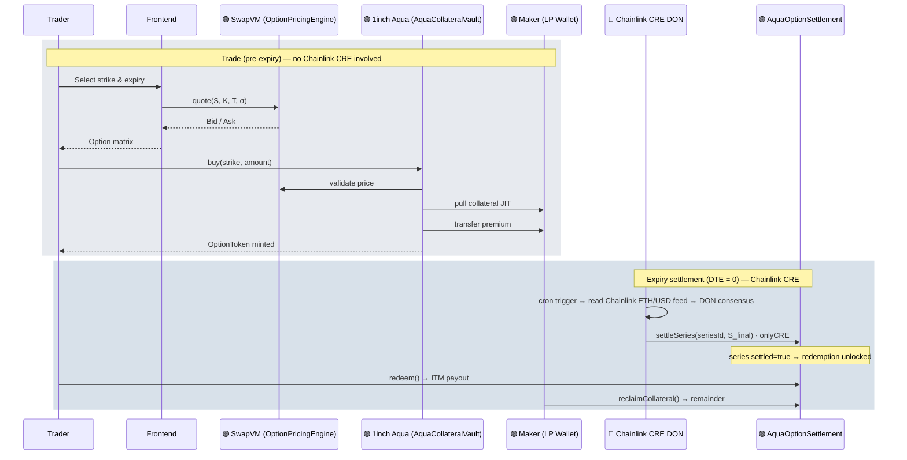
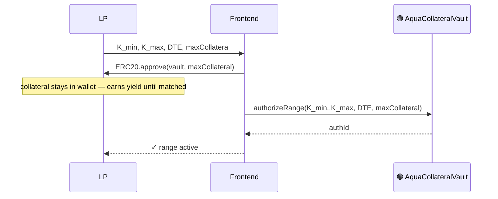
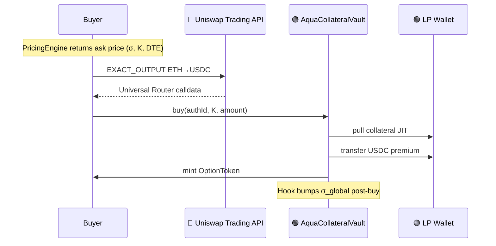
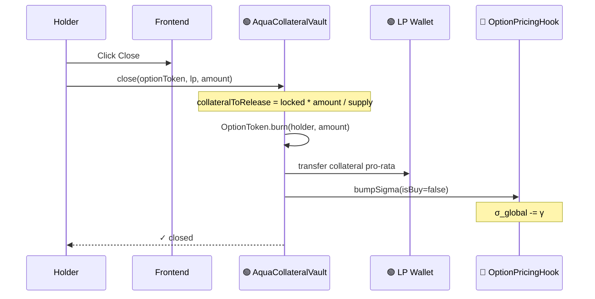
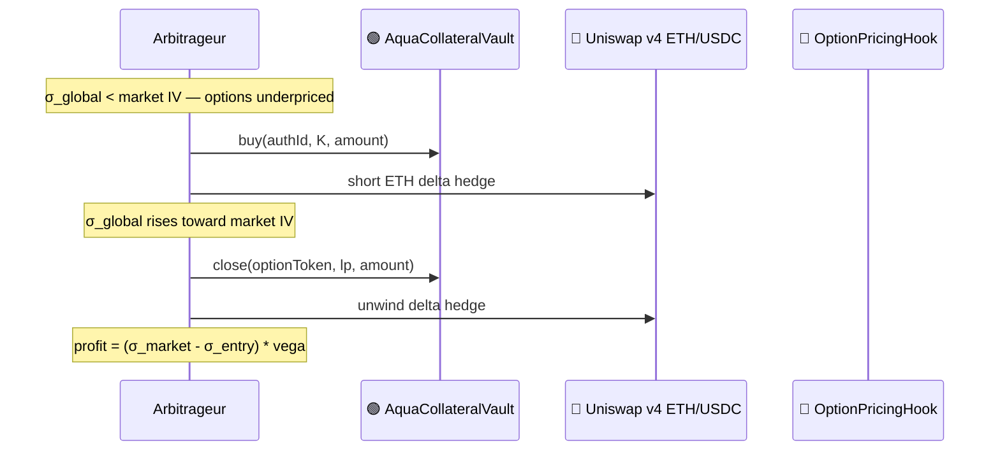
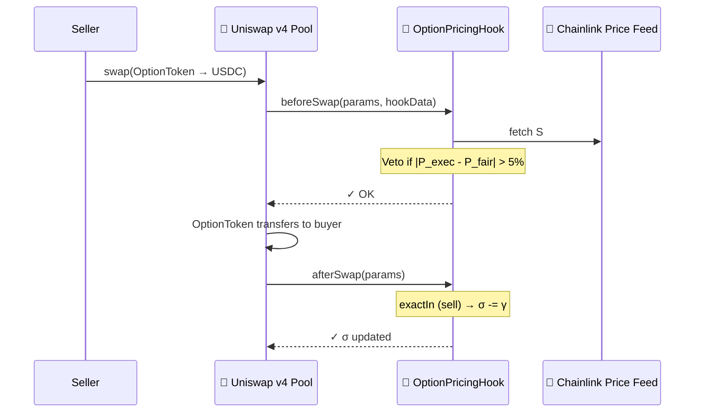
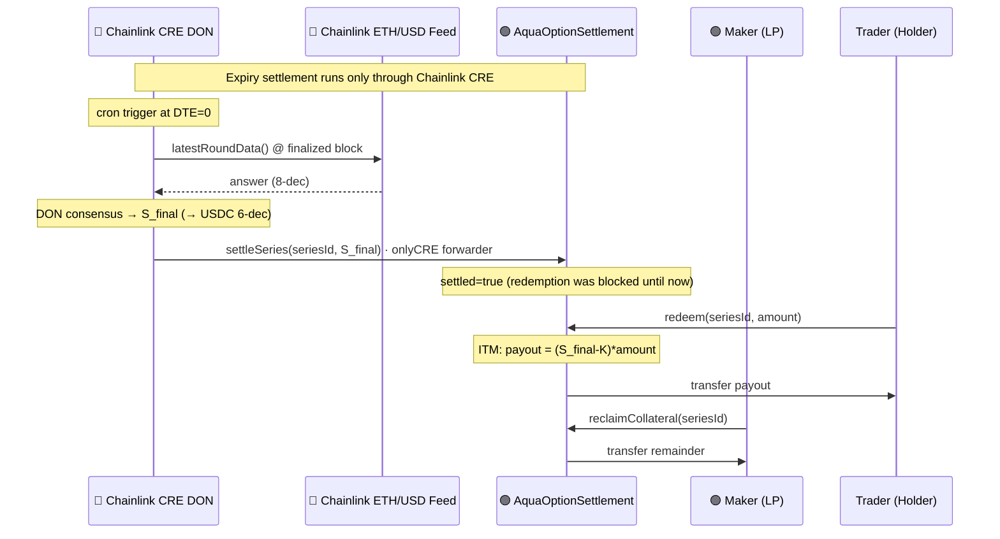

# Smile

TL;DR: Standard options market potentially as popular as Robinhood, decentralized as Polymarket.

A non-custodial, parametric options marketplace that solves three interlocking problems in DeFi options: thin liquidity at each strike, yield-killing collateral lock-up, and the absence of emergent market makers. By combining **1inch Aqua**, **Uniswap v4 Hooks**, and **Chainlink CRE**, LPs can quote an entire strike range from one capital pool — while their collateral keeps earning DeFi yield until a buyer actually matches.

---

## Table of Contents

1. [The Thesis](#-the-thesis)
2. [Architecture](#%EF%B8%8F-architecture)
3. [Mathematical Specification](#-mathematical-specification)
4. [Flow Diagrams](#-flow-diagrams)
5. [Deployed Addresses (Sepolia)](#-deployed-addresses-sepolia)
6. [Deployment Notes & Failures](#%EF%B8%8F-deployment-notes--failures)
7. [How to Run the Project](#%EF%B8%8F-how-to-run-the-project)
8. [End-to-End Demo Walkthrough](#end-to-end-demo-walkthrough)
9. [Glossary](#-glossary)
10. [Project Structure](#%EF%B8%8F-project-structure)
11. [Technical Stack](#technical-stack)
12. [Foundry Usage](#foundry-usage)

---

## 🚀 The Thesis

While prediction markets — binary options on event outcomes — have been widely successful in DeFi (Polymarket, Augur), standard options have not. Prediction markets do not offer many strategies retail traders have been increasingly investing in: selling covered calls to generate yield on held ETH, selling cash-secured puts to acquire ETH at a discount, buying butterflies to express a range-bound view on volatility, etc. The building blocks for this popular market requires a functioning options market with real liquidity across strikes and expiries for standard options (buys and sells of puts and calls). That market has never materialized on-chain: Ribbon and Friktion pioneered DeFi Options Vaults (DOVs) but suffer from trapped liquidity: collateral is locked per strike chosen by the vault manager, leaving the rest of the chain empty. Premia introduced RFQ-based pricing that relies on institutional market makers for quotes, creating a dependency on off-chain liquidity.

Smile attempts to overcome these limitations to on-chain standard opions trading by using Aqua's non-custodial LP to remediate:

1. Liquidity fragmentation across strikes and expiries, until a buyer is matched. Makers can offer liquidity across a range of strikes and expiries, increasing net liquidity.
2. Collateral lockup in LPs, and forfeited dividend yield — which is not a limitation of standard options writers — is also removed by Aqua's non-custodial LP.
3. Standard options markets work because broker-dealers delta-hedge their books against the spot market. Smile attempts to use the trading and settlement functionality provided by Uniswap and Chainlink to allow clever LPs and arbitrageurs to continuously arbitraging away mispricings between options and the underlying. Specifically:
   - Fast trading and premium transfer via Uniswap Trading API
   - Vol surface repricing post-trade via Uniswap v4 Hooks across strikes and expiries
   - Options payoff settlement and redemption via Chainlink CRE

---

## 🏗️ Architecture

| Layer          | Component                                     | Functionality                                                                                                                                                                                                                    |
| :------------- | :-------------------------------------------- | :------------------------------------------------------------------------------------------------------------------------------------------------------------------------------------------------------------------------------- |
| **Pricing**    | `OptionPricingEngine`                         | Stateless parametric premium: $\sigma_{strike} = \sigma_{global} \cdot (1 + \alpha \cdot \ln(K/S)^2)$, time-value $= S \cdot \sigma_{strike} \cdot \sqrt{T}$.                                                                    |
| **Liquidity**  | `AquaCollateralVault`                         | LP calls `authorizeRange(K_{min}, K_{max}, \text{DTE}, \text{maxCollateral})`. On `buy()`, collateral is pulled JIT from LP wallet; premium flows buyer → LP directly. OptionToken deployed lazily per strike.                   |
| **Market**     | `OptionPricingHook` + **Uniswap Trading API** | v4 Hook: `beforeSwap` vetoes mispriced trades; `afterSwap` adjusts $\sigma_{global}$. Trading API used for (1) live ETH/USD spot price and (2) routing the buyer's ETH→USDC premium swap via the Universal Router on each trade. |
| **Settlement** | `AquaOptionSettlement` + Chainlink CRE        | At expiry a scheduled CRE DON reads the canonical Chainlink ETH/USD feed (the same feed the app shows for spot), reaches consensus on the finalized value, and writes $S_{final}$ on-chain via `settleSeries()`; holders redeem ITM payouts.                                                                                                             |
| **Asset**      | `OptionToken`                                 | ERC-20 option position. Vault is owner, so can burn without allowance. Tradeable on any DEX for secondary-market price discovery.                                                                                                |

### Collateralization Model

**V1 (current) — Cash-Secured / Covered (Fully Collateralized)**

The simplest and safest model. To mint an ETH Call at a 3,500 strike, the LP backs it with 1 WETH (Covered Call). To mint a Put, the LP backs it with 3,500 USDC (Cash-Secured Put). The collateral is authorized JIT via Aqua — it never leaves the LP's wallet until a buyer matches — but it is always fully present and earmarked.

Solvency is trivially guaranteed: if the option expires in-the-money, the locked assets are delivered to the buyer. No price oracle is needed for margining and no liquidation engine exists — there is nothing to liquidate.

**V2 (out of scope) — Margin & Liquidation (Under-Collateralized)**

Advanced platforms like Derive allow LPs to post fractional collateral (e.g., 500 USDC to back a 3,500 ETH Call). As spot moves against the LP, the liability grows. If collateral falls below a safety threshold (e.g., 110% of the option's current market value), external liquidation bots forcibly close the position — buying back the option from the market using the LP's remaining collateral before bad debt accrues.

This model unlocks capital efficiency but requires an on-chain margin engine, a liquidation keeper network, and robust price feeds at sub-second granularity. It is explicitly out of scope for V1.

---

## 📐 Mathematical Specification

### 1. Parametric Volatility Smile

$$\sigma_{strike} = \sigma_{global} \cdot (1 + \alpha \cdot \ln(K/S)^2)$$

- $\sigma_{global}$: demand-weighted baseline IV, adjusted by every primary-market trade and secondary-market swap.
- $\alpha$: smile curvature (default 2.0). OTM/ITM strikes price above $\sigma_{global}$; ATM returns $\sigma_{global}$ exactly.
- $K/S$: moneyness ratio.

### 2. Premium Calculation

$$P = \underbrace{\max(S - K,\, 0)}_{\text{intrinsic}} + \underbrace{S \cdot \sigma_{strike} \cdot \sqrt{T}}_{\text{time-value}}$$

- **Ask (buy):** rounds up 1 wei.
- **Bid (sell):** floor.

Gas-efficient on-chain approximation — omits $N(d_1)$ and $N(d_2)$ to avoid square-root-heavy distributions.

### 3. σ Feedback Loop

$$\sigma_{global,\,t+1} = \sigma_{global,\,t} + \gamma \cdot \text{sign}(\text{trade})$$

- $+\gamma$ on every `buy()` or secondary-market `exactOut` swap (demand signal).
- $-\gamma$ on every `close()` or secondary-market `exactIn` swap (supply signal).
- $\gamma = 0.5\%$ per trade. This creates a price-impact-like mechanism: heavy buying steepens the smile and raises premiums, attracting arbitrageurs who sell/close to earn the spread.

### 4. Black-Scholes Delta (Frontend)

Delta ($\Delta$) is computed client-side for the matrix display. Not used in on-chain pricing.

$$\Delta = N(d_1), \qquad d_1 = \frac{\ln(S/K) + \frac{1}{2}\sigma_{strike}^2 \cdot T}{\sigma_{strike} \cdot \sqrt{T}}$$

$N(\cdot)$ is approximated via Abramowitz & Stegun 26.2.17 (max error $1.5 \times 10^{-7}$, no lookup tables). $\sigma_{strike}$ from §1 is used — ensuring delta reflects the vol surface curvature, not flat vol.

> Delta ranges 0–1 for calls (0 = deep OTM, 1 = deep ITM). A 0.5-delta call is approximately ATM.

### 5. Chainlink CRE — Decentralized Expiry Settlement

**Why the app needs CRE.** A parametric option is only as trustworthy as the price it settles against. At expiry every open series needs one **final spot price** $S_{final}$ written on-chain, because that single number decides every payout: holders redeem the in-the-money difference and the LP reclaims the remaining collateral (see [§6 flow](#6-settlement--redemption-chainlink-cre)). Settlement is the one part of the option lifecycle that can't be a pure on-chain formula — it needs an external price *and* a guaranteed trigger at $\text{DTE}=0$, with no trusted keeper in the loop.

**What CRE does for Smile** — it is the settlement layer:

- **Scheduled, not poked** — a CRE *cron trigger* fires the settlement workflow at expiry, so no keeper bot or user transaction is required to settle a series.
- **Reads the canonical feed** — the DON reads the same **Chainlink ETH/USD aggregator** the frontend uses for live spot ([`0x694AA1…25306`](frontend/hooks/useUniswapSpot.ts#L11) on Sepolia) via `latestRoundData()` at the last *finalized* block, so every node observes an identical value:

$$S_{final} = \mathtt{latestRoundData().answer} \;\; (\text{8-dec}) \;\rightarrow\; \text{USDC 6-dec}$$

- **Signed, on-chain write** — the DON signs the consensus result and delivers it through the CRE forwarder, which calls `AquaOptionSettlement.settleSeries(seriesId, S_final)`. That call is the single on-chain state change that flips a series from *open* to *settled* and unlocks redemption.

In short: 1inch Aqua holds the collateral, Uniswap prices and routes the trade, and **Chainlink CRE closes the loop at expiry** — turning a live series into a settled, redeemable claim using the project's canonical price feed, on a schedule, with no trusted keeper.

> **Design note.** Because the settlement price is read from an on-chain Chainlink feed, the DON's role here is a *scheduled, trust-minimized keeper* (deterministic read + signed write) rather than novel off-chain data sourcing. Swapping the on-chain feed read for direct CEX fetches with median DON consensus is a localized change to the workflow's price-read step if a venue price is ever preferred over the aggregator.

---

## 🔄 Flow Diagrams

> Color key: 🟢 1inch Aqua · 🩷 Uniswap · 🔵 Chainlink

### 0. System Overview



### 1. Range Authorization (LP)

The LP authorizes a strike range from one collateral pool. No collateral moves at this stage — it stays in the LP's wallet earning yield. The LP also pre-approves the vault to spend up to `maxCollateral` JIT.



### 2. Primary Market Buy (Trader)

Premium payment is routed through the **Uniswap Trading API** (`EXACT_OUTPUT` ETH→USDC), giving an on-chain Uniswap tx before the vault call.



### 3. Close Position / Early Unwind (Holder)

A holder unwinds before expiry. Vault burns their tokens, returns collateral to LP pro-rata, and decrements σ. This path is also exercised by arbitrageurs closing delta-hedged positions.



### 4. Arbitrageur as Emergent Market Maker

When on-chain σ diverges from market IV, arbitrageurs can capture the spread by buying the primary market and hedging on spot. Their close activity re-equilibrates σ_global. This is the emergent market-making loop.



### 5. Secondary Market Swap (Uniswap v4)

Existing OptionTokens can be resold. The hook vetoes mispriced swaps and adjusts σ. Secondary market only — ERC-20 ownership transfers, no minting.



### 6. Settlement & Redemption (Chainlink CRE)

At expiry, the CRE DON reads the Chainlink ETH/USD feed (the same one the app uses for spot), reaches consensus on the finalized value, and calls `settleSeries()`. Holders redeem ITM payouts; LP reclaims remaining collateral.



---

## 📍 Deployed Addresses (Sepolia)

| Contract                 | Address                                                                                                                         |
| ------------------------ | ------------------------------------------------------------------------------------------------------------------------------- |
| **OptionPricingEngine**  | [`0x3f5a5b1972Ddac7E81fdf7F6AEFC2633Fa8FF532`](https://sepolia.etherscan.io/address/0x3f5a5b1972Ddac7E81fdf7F6AEFC2633Fa8FF532) |
| **OptionPricingHook**    | [`0x15578B9248b574194867Ab204bE4161213Acf194`](https://sepolia.etherscan.io/address/0x15578B9248b574194867Ab204bE4161213Acf194) |
| **AquaCollateralVault**  | [`0x5115fbdb810D1dB316034fF670c65c45d875f887`](https://sepolia.etherscan.io/address/0x5115fbdb810D1dB316034fF670c65c45d875f887) |
| **AquaOptionSettlement** | [`0x5c9E7BB8db084A955acD519f61287d24Ff24F211`](https://sepolia.etherscan.io/address/0x5c9E7BB8db084A955acD519f61287d24Ff24F211) |
| **USDC** (Circle Sepolia) | [`0x1c7D4B196Cb0C7B01d743Fbc6116a902379C7238`](https://sepolia.etherscan.io/address/0x1c7D4B196Cb0C7B01d743Fbc6116a902379C7238) |
| **WETH** (canonical Sepolia) | [`0x7b79995e5f793A07Bc00c21412e50Ecae098E7f9`](https://sepolia.etherscan.io/address/0x7b79995e5f793A07Bc00c21412e50Ecae098E7f9) |

> _Live on Sepolia testnet. Frontend deployed at **https://oslinin.github.io/Smile** (WalletConnect enabled — switch MetaMask to Sepolia to interact)._

---

## ⚠️ Deployment Notes & Failures

1. **HookMiner Latency**: Finding a Uniswap v4 Hook address with the required flag prefix took significantly longer than expected, delaying `OptionPricingHook` deployment.
2. **SwapVM Instruction Set**: Implementing a stateless pricing engine in Solidity to mirror SwapVM bytecode required several iterations. Stack-too-deep errors in `buy()` were resolved by enabling `via_ir = true` in `foundry.toml`.
3. **Chainlink CRE Price Source**: An initial design fetched ETH/USD from CEX REST APIs per node, which hit Binance V3 rate limits and risked cross-node divergence during simulation. Resolved by reading the canonical Chainlink ETH/USD aggregator on-chain at the last finalized block — every DON node observes the same value, so settlement consensus is deterministic and matches the price the app displays.
4. **GitHub Pages SPA Routing**: Next.js static export broke on refresh. Fixed with `.nojekyll` and static export config.

---

## 🛠️ How to Run the Project

### 1. View Live Site (GitHub Pages)

**URL:** `https://oslinin.github.io/Smile`

### 2. Local Frontend Development

```bash
cd frontend
npm install
npm run dev
```

Open http://localhost:3000. Connect MetaMask to Sepolia.

### 3. Smart Contract Development (Foundry)

```bash
forge build   # compile all contracts
forge test    # run 34 tests
```

### 4. Deploy to Anvil (Local)

The quickest path: `./local.sh` starts Anvil, deploys all contracts, writes `frontend/.env.local`, and launches the dev server in one step.

To deploy manually (e.g., to iterate on the script):

```bash
# Terminal 1 — start Anvil
anvil --chain-id 31337 --block-time 1 --port 8545

# Terminal 2 — deploy (uses Anvil's pre-funded account 0)
PRIVATE_KEY=0xac0974bec39a17e36ba4a6b4d238ff944bacb478cbed5efcae784d7bf4f2ff80 \
  forge script script/Deploy.s.sol:Deploy \
  --rpc-url http://localhost:8545 \
  --broadcast \
  --skip-simulation
```

### 5. Deploy to Sepolia

Copy `.env.example` → `.env`, fill in `PRIVATE_KEY` and `RPC_SEPOLIA`, then:

```bash
source .env
PRIVATE_KEY="$PRIVATE_KEY" forge script script/Deploy.s.sol:Deploy \
  --rpc-url "$RPC_SEPOLIA" \
  --broadcast
```

The script outputs `NEXT_PUBLIC_*` addresses; copy them into `frontend/.env.local` (or set `NEXT_PUBLIC_CHAIN_ID=11155111`).

To verify contracts on Etherscan at the same time:

```bash
source .env
PRIVATE_KEY="$PRIVATE_KEY" forge script script/Deploy.s.sol:Deploy \
  --rpc-url "$RPC_SEPOLIA" \
  --broadcast \
  --verify \
  --etherscan-api-key "$ETHERSCAN_API_KEY"
```

### 6. Chainlink CRE Workflow

The required Chainlink integration is a **CRE workflow** that performs an on-chain
state change: on a cron schedule the DON reads the Chainlink ETH/USD feed at the
last finalized block, reaches consensus, and the DON-signed report calls
`AquaOptionSettlement.settleSeries(seriesId, spotPrice)` on-chain.

| File | Role |
| ---- | ---- |
| [`cre-workflow/settlement/workflow.ts`](cre-workflow/settlement/workflow.ts) | The workflow itself — cron trigger → `callContract(latestRoundData)` on the Chainlink feed → DON consensus → DON-signed `writeReport` → `settleSeries()`. Compiles to WASM. |
| [`cre-workflow/settlement/config.json`](cre-workflow/settlement/config.json) | Runtime config: `schedule`, `seriesId`, target `settlementAddress`, `priceFeedAddress` (Chainlink ETH/USD), `gasLimit`, and chain selector. |
| [`cre-workflow/settlement/package.json`](cre-workflow/settlement/package.json) | Deps + `typecheck` script. Build + simulate run via the **`cre` CLI** (`cre workflow build\|simulate settlement`). |

> **Access control.** `settleSeries()` carries an `onlyCRE` modifier
> ([AquaOptionSettlement.sol:38](src/vaults/AquaOptionSettlement.sol#L38)) — only the
> CRE forwarder address passed to the constructor at deploy time can write the
> settlement price. The simulator uses a local forwarder; the live path requires the
> contract to be deployed with your registered CRE forwarder address.

#### Prerequisites

The current CRE CLI (v1.20.x) reworks several commands; this workflow is pinned to
**v1.11.0** to match `@chainlink/cre-sdk@^1.11.0`. The CLI is a binary installed via
Chainlink's official script (it is **not** an npm package).

```bash
# 1. CRE CLI v1.11.0 — installs to ~/.cre/bin and appends it to PATH in ~/.bashrc.
curl -sSL https://app.chain.link/cre/install.sh | bash -s -- v1.11.0
source ~/.bashrc          # or open a new shell, so `cre` is on PATH
cre version               # → CRE CLI version v1.11.0

# 2. Bun ≥ 1.0 — cre-compile uses it to build the WASM target.
curl -fsSL https://bun.sh/install | bash

# 3. Authenticate — required even for local simulation.
cre login                 # opens a browser; or, non-interactively:
# echo 'CRE_API_KEY=<key from Account Settings at https://app.chain.link>' >> cre-workflow/.env

# 4. Install workflow + contract-binding deps (each folder has its own package.json).
cd cre-workflow
( cd settlement && bun install )
( cd contracts  && bun install )

# 5. (Optional) Regenerate the typed contract binding from the Foundry ABI.
#    Already committed under contracts/evm/ts/generated/; only needed if the ABI changes.
cp ../out/AquaOptionSettlement.sol/AquaOptionSettlement.json contracts/evm/src/abi/
cre generate-bindings evm --language typescript
```

Edit [`cre-workflow/settlement/config.json`](cre-workflow/settlement/config.json) so `seriesId` matches the
series you registered on-chain (copy it from the **On-Chain Proof** tab or from the
`forge script` deploy logs), `evm.settlementAddress` points at your deployed
`AquaOptionSettlement`, and `evm.priceFeedAddress` is the Chainlink ETH/USD feed for the
chain (Sepolia: `0x694AA1769357215DE4FAC081bf1f309aDC325306`). The active CRE target is
read from `CRE_TARGET` in `cre-workflow/.env` (`staging-settings` → Sepolia RPC in
[`project.yaml`](cre-workflow/project.yaml)).

> **Build needs no auth; simulate does.** `cre workflow build` compiles the WASM
> locally. `cre workflow simulate` gates on auth — run `cre login` (or set
> `CRE_API_KEY`) first.

---

### 6a. Demonstrate a successful CRE CLI simulation (the verified path)

First confirm it compiles (no auth needed):

```bash
cd cre-workflow
cre workflow build settlement
# ✓ Workflow compiled successfully
# ✓ Build output written to settlement/binary.wasm
```

Then run the simulation. The simulator spins up a local CRE runtime, fires the cron
trigger, runs the workflow's on-chain feed read + DON consensus, and signs the report —
all against the Sepolia RPC from `project.yaml`:

```bash
cre workflow simulate settlement --non-interactive --trigger-index 0
# `--non-interactive --trigger-index 0` selects the single cron trigger;
# omit both to pick it from an interactive menu.
```

Verified output (CLI v1.11.0, reading the live Sepolia ETH/USD feed — exit code `0`):

```text
Initializing...
Loading settings...
Checking RPC connectivity...
Compiling workflow...
✓ Workflow compiled
✓ Simulation limits enabled
  HTTP: req=120kb resp=250kb timeout=10s | ConfHTTP: req=125kb resp=500kb timeout=1m30s | Consensus obs=25kb | ChainWrite report=50kb gas=10000000 | WASM binary=100mb compressed=20mb
  Binary hash: 9d57d352ac4d3e6ca2e4540cd52e22875e93e15e96f557c8a6c9bfc35fe24b38
  Config hash: 09b81d8b718c888f7c668324102c18f369f49391a15adee7cbc76e576aea9331
2026-06-14T07:00:26Z [SIMULATION] Simulator Initialized

2026-06-14T07:00:26Z [SIMULATION] Running trigger trigger=cron-trigger@1.0.0
2026-06-14T07:00:26Z [USER LOG] [CRE] Option settlement workflow triggered
2026-06-14T07:00:26Z [USER LOG] [CRE] Chainlink ETH/USD: $1675.28
2026-06-14T07:00:26Z [USER LOG] [CRE] settleSeries(0x0000…0001, 1675280000) submitted — tx 0x0000…0000

✓ Workflow Simulation Result:
"1675280000"

2026-06-14T07:00:26Z [SIMULATION] Execution finished signal received
2026-06-14T07:00:26Z [SIMULATION] Skipping WorkflowEngineV2
2026-06-14T07:00:26Z [SIMULATION] Failed to cleanup beholder error=BeholderClient has not been started: cannot stop unstarted service

╭──────────────────────────────────────────────────────╮
│ Simulation complete! Ready to deploy your workflow?  │
│                                                      │
│ Run cre account access to request deployment access. │
╰──────────────────────────────────────────────────────╯
```

`1675280000` is the feed price ($1,675.28) in USDC 6-decimal fixed-point. Notes on the
output:

- **The tx hash is zero** because a plain simulation routes the EVM write through a
  **mock** forwarder rather than broadcasting — the trigger → feed read → DON consensus →
  report-signing path is fully exercised, which is what the CRE CLI simulation verifies.
- **`Failed to cleanup beholder …`** is a benign teardown log printed *after* the result;
  the simulator stops a telemetry client it never started in local mode. The run still
  exits `0`. Filter it for a clean demo: `… | grep -v "Failed to cleanup beholder"`.

> **Note — live broadcast is out of scope here.** CRE delivers DON-signed reports through
> a KeystoneForwarder that calls `onReport(bytes,bytes)` on the receiver, whereas
> `AquaOptionSettlement` exposes a plain `settleSeries(bytes32,uint256)` guarded by
> `onlyCRE`. Wiring the live on-chain write (an `onReport` entrypoint + registered
> forwarder) is a follow-up; the CRE CLI **simulation above** is the demonstrated path.

---

## End-to-End Demo Walkthrough

| Step | Actor  | Action                                                                     | Contract call                                              |
| ---- | ------ | -------------------------------------------------------------------------- | ---------------------------------------------------------- |
| 1    | LP     | Connect wallet → _Authorize Strike Range_ → approve collateral + authorize | `ERC20.approve()` + `AquaCollateralVault.authorizeRange()` |
| 2    | Trader | Click **Buy** on a strike within LP's range → approve USDC → buy           | `ERC20.approve(USDC)` + `AquaCollateralVault.buy()`        |
| 3    | Trader | Click **Close** to unwind early                                            | `AquaCollateralVault.close()`                              |
| 4    | —      | Paste `seriesId` into `cre-workflow/settlement/config.json`, run `cre workflow simulate settlement` | `AquaOptionSettlement.settleSeries()` via CRE              |
| 5    | Trader | Call `redeem()` to collect payout (ITM only)                               | `AquaOptionSettlement.redeem()`                            |
| 6    | LP     | Call `reclaimCollateral()` to recover remaining collateral                 | `AquaOptionSettlement.reclaimCollateral()`                 |

---

## 📖 Glossary

### Ethereum / Blockchain Terms

- **EOA (Externally Owned Account):** A standard Ethereum wallet controlled by a private key (e.g., MetaMask). LPs and traders use EOAs; the protocol never takes custody of their funds.
- **ERC-20:** Standard interface for fungible tokens. `OptionToken` follows this standard so positions can be resold on any DEX.
- **Non-custodial:** The protocol never holds user assets. Collateral stays in LP wallets until a buyer matches; the vault only moves funds atomically on match.

### DeFi Terms

- **LP (Liquidity Provider):** A participant who backs trades. Here, LPs authorize the vault to pull collateral JIT — they are yield-seeking covered-option writers, not market makers.
- **Maker:** The option writer (LP). Authorizes a strike range, provides collateral JIT, receives premiums, reclaims collateral at expiry.
- **Trader:** The option buyer. Pays premium, receives an OptionToken representing the long position, redeems ITM payout at settlement.
- **CEX (Centralized Exchange):** Off-chain exchange (Binance, Coinbase, Kraken). Referenced as real-world ETH/USD price sources; the live frontend spot is sourced via the Uniswap Trading API, while settlement reads the on-chain Chainlink feed.
- **DEX (Decentralized Exchange):** On-chain exchange. Uniswap v4 provides secondary-market trading for OptionTokens.
- **DON (Decentralized Oracle Network):** A tamper-resistant network of node operators that securely delivers external data to smart contracts (Chainlink).
- **CRE (Chainlink Runtime Environment):** Off-chain computation environment for custom DON workflows (successor to Chainlink Functions).
- **JIT (Just-In-Time) Liquidity:** Capital pulled from an LP's wallet only at trade execution — never locked idle. Enabled by 1inch Aqua.

### Options Terms

- **Delta (Δ):** Rate of change of premium per $1 move in spot. 0 = deep OTM, 1 = deep ITM for calls. Computed frontend-only via $N(d_1)$ using smile-adjusted $\sigma_{strike}$.
- **Strike Price (K):** Price at which the option holder has the right to buy (call) or sell (put) at expiry.
- **Spot Price (S):** Current market price of ETH/USDC, sourced from Chainlink.
- **DTE (Days to Expiry):** Time remaining until settlement, in days.
- **K_min / K_max:** The lower and upper bounds of an LP's authorized strike range.
- **OTM (Out-of-The-Money):** No intrinsic value at expiry; LP reclaims 100% of collateral.
- **ITM (In-The-Money):** Intrinsic value at expiry; holder receives payout, LP gets remainder.
- **IV (Implied Volatility / σ):** Market's forecast of price movement. `σ_global` is demand-weighted and adjusts with every trade.
- **Volatility Smile:** OTM/ITM options trade at higher IV than ATM; modeled by $\alpha \cdot \ln(K/S)^2$ curvature.
- **Black-Scholes:** Mathematical option pricing model. This protocol uses a parametric approximation (gas-efficient, no $N(d_1)$ on-chain).

### Protocol-Specific Terms

- **Range Authorization:** LP's single on-chain commitment to write options at any strike $K \in [K_{min}, K_{max}]$ from one collateral pool. First buy at a new strike deploys an OptionToken lazily.
- **Yield Double-Dip:** LP earns staking/lending yield on collateral (because it stays in their wallet via Aqua JIT) _and_ option premium from buyers. Impossible in vault-locking designs.
- **σ_global Feedback Loop:** Every primary-market buy bumps $\sigma_{global}$ up; every close/sell decrements it. Creates on-chain price discovery that arbitrageurs can trade against.
- **Emergent Market Maker:** An arbitrageur who buys underpriced options (low $\sigma_{global}$) on the primary market, delta-hedges on Uniswap, and closes when σ corrects — capturing the spread while enforcing IV consistency.
- **Covered Call / Cash-Secured Put:** Fully collateralized option: WETH backs calls (LP delivers ETH if exercised), USDC backs puts (LP purchases ETH if exercised). No naked writing; collateral IS the hedge.
- **SwapVM:** 1inch highly-optimized VM for custom matching and pricing logic.
- **1inch Aqua:** 1inch primitive for JIT transfer of assets from LP self-custodial wallets.
- **Uniswap v4 Hooks:** Smart contracts at swap lifecycle points: `beforeSwap` vetoes mispriced trades, `afterSwap` adjusts IV.
- **`latestRoundData()`:** The Chainlink aggregator read returning the latest ETH/USD answer (8-decimal). CRE reads it at the last finalized block so every DON node agrees on the settlement price.

---

## 🏗️ Project Structure

```text
├── cre-workflow/             # Chainlink CRE Logic (TypeScript)
│   ├── config.json           # Series ID + settlement contract config
│   └── workflow.ts           # DON workflow (CRE SDK, compiled to WASM)
├── frontend/                 # Next.js Application
│   ├── components/           # AuthorizeRange, OptionMatrix, LPDashboard
│   ├── config/               # Wagmi + contract addresses
│   └── app/                  # Next.js App Router
├── src/                      # Smart Contracts (Solidity)
│   ├── hooks/                # OptionPricingHook (Uniswap v4)
│   ├── swapvm/               # OptionPricingEngine (parametric B/S)
│   ├── vaults/               # AquaCollateralVault + AquaOptionSettlement
│   └── OptionToken.sol       # ERC-20 option position
├── test/                     # Foundry tests (34 passing)
├── foundry.toml              # Foundry config (via_ir = true for stack depth)
└── remappings.txt
```

---

## Technical Stack

- **Smart Contracts**: Solidity 0.8.35 (Foundry, via_ir)
- **Frontend**: Next.js 16, Tailwind CSS, Wagmi/Viem
- **Oracle/Settlement**: Chainlink CRE SDK
- **DEX Infrastructure**: Uniswap v4 Hooks, 1inch Aqua

---

_Built for the 1inch + Uniswap + Chainlink Hackathon._

## Foundry Usage

```shell
forge build
forge test
forge --help
anvil --help
cast --help
```
