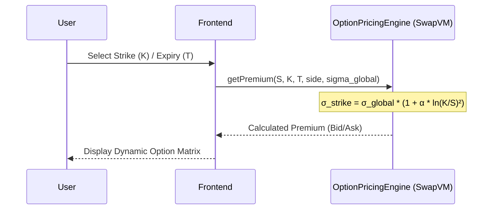
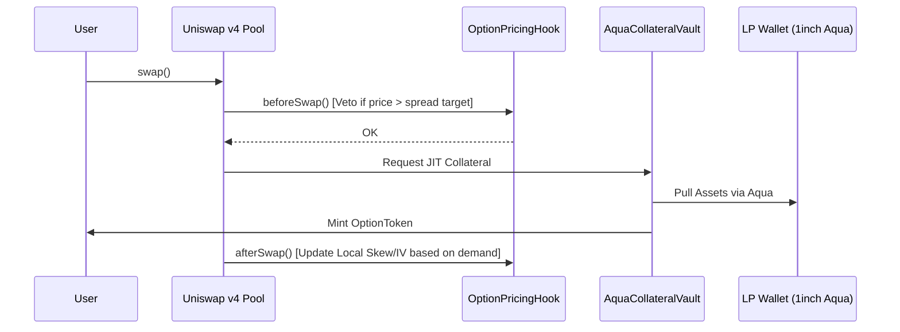
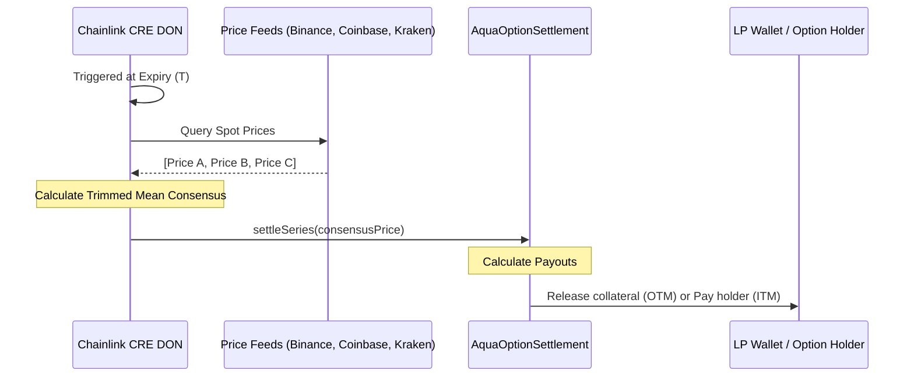

# Parametric Options Marketplace

A non-custodial, parametric options marketplace designed to solve the low-liquidity problem in decentralized options. By combining **1inch Aqua**, **Uniswap v4 Hooks**, and **Chainlink CRE**, this platform allows LPs to provide "Just-In-Time" (JIT) liquidity across an entire option chain without fragmenting capital.

## 🚀 The Thesis
Liquidity in options markets is typically thin because capital is locked per strike and expiry. Our marketplace uses:
- **1inch Aqua / SwapVM**: LP capital stays in the LP's wallet and is pulled only when a trade matches.
- **Uniswap v4 Hooks**: Acts as the price-discovery layer. `beforeSwap` prevents toxic flow, and `afterSwap` dynamically reprices Implied Volatility (IV) based on demand.
- **Chainlink CRE**: A decentralized consensus mechanism for settling series at expiry.

## 🏗️ Architecture

| Layer | Component | Functionality |
| :--- | :--- | :--- |
| **Pricing** | `OptionPricingEngine` | Stateless calculation of premiums using a parametric volatility smile ($\sigma_{strike} = \sigma_{global} \cdot (1 + \alpha \cdot \ln(K/S)^2)$). |
| **Liquidity** | `AquaCollateralVault` | Integrated with **1inch Aqua** for Just-In-Time (JIT) collateral pulling from LP wallets upon trade execution. |
| **Market** | `OptionPricingHook` | A **Uniswap v4 Hook** that manages trade validation in `beforeSwap` and demand-driven IV adjustments in `afterSwap`. |
| **Settlement** | `Chainlink CRE` | Multi-node consensus for fetching spot prices from CEXs and executing on-chain settlement via `settleSeries`. |
| **Asset** | `OptionToken` | Standardized ERC-20 representation of the option position for secondary market composability. |

## 📐 Mathematical Specification

The marketplace utilizes a stateless pricing model where liquidity is virtualized and premiums are calculated on-the-fly.

### 1. SwapVM: Parametric Pricing Engine
The premium $P$ is derived from a parametric approximation of the Black-Scholes model, focusing on computational efficiency for on-chain execution.

**Parametric Volatility Smile:**
$$\sigma_{strike} = \sigma_{global} \cdot (1 + \alpha \cdot \ln(K/S)^2)$$
Where:
- $\sigma_{global}$: The baseline implied volatility (adjusted by market demand).
- $\alpha$: The "smile" curvature parameter.
- $K/S$: The moneyness ratio of Strike to Spot.

**Premium Calculation (Approximation):**
$$P = \text{Intrinsic Value} + (S \cdot \sigma_{strike} \cdot \sqrt{T})$$
- **Ask Price (Buy):** Rounded up to the nearest tick to ensure LP profitability.
- **Bid Price (Sell):** Rounded down to the nearest tick.

### 2. Uniswap Hook: Dynamic Volatility Feedback
The `OptionPricingHook` acts as a controller for the global volatility parameter $\sigma_{global}$, ensuring the market stays balanced.

**Post-Trade IV Adjustment (`afterSwap`):**
$$\sigma_{global, t+1} = \sigma_{global, t} \pm \gamma$$
- $+\gamma$: Triggered on `exactOut` (User buys an option, increasing demand).
- $-\gamma$: Triggered on `exactIn` (User sells an option, increasing supply).

**Veto Logic (`beforeSwap`):**
Executes a trade only if the execution price $P_{exec}$ satisfies:
$$|P_{exec} - P_{target}| < \epsilon$$
where $P_{target}$ is the premium calculated using the real-time Chainlink oracle spot price.

### 3. Chainlink CRE: Consensus Settlement
At expiry $T$, the final settlement price $S_{final}$ is determined by a decentralized consensus mechanism to ensure robustness against exchange-level manipulation or API failures (such as the Binance rate-limiting encountered during development).

**Trimmed Mean Algorithm:**
1. **Fetch:** Query $n$ independent price sources (Binance, Coinbase, Kraken).
2. **Sort:** Arrange successful observations in ascending order: $\{x_1, x_2, \dots, x_n\}$.
3. **Trim:** To eliminate outliers, the highest and lowest values are removed if at least 3 sources are available.
   $$\mathcal{X}_{trimmed} = \begin{cases} \{x_2, \dots, x_{n-1}\} & \text{if } n \ge 3 \\ \{x_1, \dots, x_n\} & \text{if } n < 3 \end{cases}$$
4. **Average:** Compute the arithmetic mean of the remaining $m$ observations.
   $$S_{final} = \frac{1}{m} \sum_{x \in \mathcal{X}_{trimmed}} x$$

This process ensures that even if one exchange's price deviates significantly due to a flash crash or local liquidity issues, the on-chain settlement remains an accurate reflection of the global spot price.

## 🔄 Flow Diagrams

### 1. Option Price Quoting (View)
The frontend polls the stateless pricing engine to render the option matrix with live Bid/Ask spreads across the entire chain without pre-allocated liquidity.



### 2. Trade Execution & JIT Liquidity
Trades go through Uniswap v4, where hooks validate pricing against the oracle and adjust volatility parameters (local skew) post-trade.



### 3. Settlement via Chainlink CRE
At expiry $T$, the decentralized Chainlink workflow reaches a consensus on the spot price and executes the final settlement on-chain.



## 📍 Deployed Addresses (Sepolia)

| Contract | Address |
| --- | --- |
| **OptionPricingEngine** | [`0x90600176DA27Fc3Daf7AfD5266c80d1b15a23014`](https://sepolia.etherscan.io/address/0x90600176DA27Fc3Daf7AfD5266c80d1b15a23014) |
| **AquaCollateralVault** | [`0x0bD5e1510ACd217E55E6744bb9e98557b4309729`](https://sepolia.etherscan.io/address/0x0bD5e1510ACd217E55E6744bb9e98557b4309729) |
| **AquaOptionSettlement** | [`0x96381D3795A73Fc6a982A9B77D51f6d3F392aDCA`](https://sepolia.etherscan.io/address/0x96381D3795A73Fc6a982A9B77D51f6d3F392aDCA) |

> *Live on Sepolia testnet. Frontend deployed at **https://132.145.158.84** (WalletConnect enabled, switch MetaMask to Sepolia to interact).*

## ⚠️ Deployment Notes & Failures

During the development and deployment phase, the following challenges were encountered:
1.  **HookMiner Latency**: Finding a valid Uniswap v4 Hook address with the required flag prefix (for `beforeSwap` and `afterSwap`) took significantly longer than anticipated in the local environment, leading to a delayed deployment of the `OptionPricingHook`.
2.  **SwapVM Instruction Set**: Implementing a stateless pricing engine in raw Solidity to mimic SwapVM bytecode required several iterations to ensure gas efficiency for the parametric volatility smile calculation.
3.  **Chainlink CRE Simulation**: Initial simulations of the CRE workflow failed due to rate limiting on the public **Binance V3 REST API**. This was resolved by implementing a "trimmed mean" consensus logic in the CRE workflow that aggregates price feeds from Binance, Coinbase, and Kraken, ensuring settlement reliability on the Sepolia testnet.
4.  **GitHub Pages SPA Routing**: The Next.js static export initially broke on refresh due to sub-routes. This was fixed by using a standard static export configuration and adding a `.nojekyll` file.

## 🛠️ How to Run the Project

### 1. View Live Site (GitHub Pages)
The frontend is automatically deployed via GitHub Actions to GitHub Pages.
**URL:** `https://<your-username>.github.io/options/`

### 2. Local Frontend Development
To run the UI locally:
```bash
cd frontend
npm install
npm run dev
```
Open http://localhost:3000 to view the application. Ensure your MetaMask is connected to Sepolia or a local Anvil node.

### 3. Smart Contract Development (Foundry)
Build the contracts:
```bash
forge build
```

Run the test suite:
```bash
forge test
```

### 4. Chainlink CRE Workflow
To simulate the settlement workflow:
```bash
cd cre-workflow
export RPC_URL=<your_rpc_url>
export CRE_PRIVATE_KEY=<your_key>
export SETTLEMENT_ADDRESS=0x9fE46736679d2D9a65F0992F2272dE9f3c7fa6e0
export SERIES_ID=<series_bytes32>
npx ts-node option-settlement.ts --simulate
```

## 📖 Glossary

- **DON (Decentralized Oracle Network):** A network of independent, tamper-resistant node operators (like Chainlink) that securely provide external data and off-chain computation to smart contracts.
- **CRE (Chainlink Runtime Environment):** A decentralized off-chain computation environment allowing developers to build custom workflows and consensus mechanisms executed by a DON (replacing older products like Functions).
- **JIT (Just-In-Time) Liquidity:** A model where capital is securely pulled from a Liquidity Provider's (LP) wallet at the exact moment a trade occurs, preventing capital from sitting idle or fragmented across multiple contracts.
- **OTM (Out-of-The-Money):** An option that has no intrinsic value at expiry (e.g., a call option where the spot price is lower than the strike price). In our vault, OTM settlements return 100% of the locked collateral to the LP.
- **ITM (In-The-Money):** An option that possesses intrinsic value at expiry. During settlement, the holder is paid out their profit, and the remaining collateral is returned to the LP.
- **IV (Implied Volatility / $\sigma$):** A metric reflecting the market's forecast of price movement. Our engine dynamically reprices IV (`σ_global`) based on real-time buy/sell pressure.
- **SwapVM:** A highly optimized virtual machine by 1inch designed for executing custom matching and pricing logic seamlessly within their ecosystem.
- **1inch Aqua:** A 1inch protocol primitive that facilitates the JIT transfer of assets directly from an LP's self-custodial wallet to back trades on demand.
- **Uniswap v4 Hooks:** Customizable smart contracts that run at specific stages of a Uniswap v4 pool's lifecycle (e.g., `beforeSwap` to veto toxic flow, `afterSwap` to adjust IV).
- **Trimmed Mean:** A consensus algorithm used in our CRE workflow that drops the highest and lowest reported spot prices before calculating the average, protecting settlement from isolated exchange flash crashes.

## 🏗️ Project Structure

```text
├── cre-workflow/             # Chainlink CRE Logic (TypeScript)
│   ├── option-settlement.ts  # Settlement simulation script
│   └── workflow.ts           # DON capability definition
├── frontend/                 # Next.js Application
│   ├── components/           # UI Components (Matrix, TradeButton, Dashboard)
│   ├── config/               # Wagmi, Viem and Contract ABIs
│   └── pages/                # Next.js routing & main application
├── src/                      # Smart Contracts (Solidity)
│   ├── hooks/                # Uniswap v4 Hooks (OptionPricingHook)
│   ├── swapvm/               # Pricing Engine (OptionPricingEngine)
│   ├── vaults/               # 1inch Aqua & Settlement Vaults
│   └── OptionToken.sol       # ERC-20 Option position contract
├── test/                     # Foundry Test Suite
├── foundry.toml              # Foundry config
├── remappings.txt            # Dependency mappings
└── PLAN.md                   # Project roadmap and thesis
```

---

## Technical Stack
- **Smart Contracts**: Solidity 0.8.26 (Foundry)
- **Frontend**: Next.js, Tailwind CSS, Wagmi/Viem
- **Oracle/Settlement**: Chainlink CRE
- **DEX Infrastructure**: Uniswap v4, 1inch Aqua

---
*Built for the 1inch + Uniswap + Chainlink Hackathon.*

## Foundry Usage

### Build
`forge build`

### Test
`forge test`

### Deploy
`forge script script/Counter.s.sol:CounterScript --rpc-url <your_rpc_url> --private-key <your_private_key>`

### Help
`forge --help`

### Help

```shell
$ forge --help
$ anvil --help
$ cast --help
```
