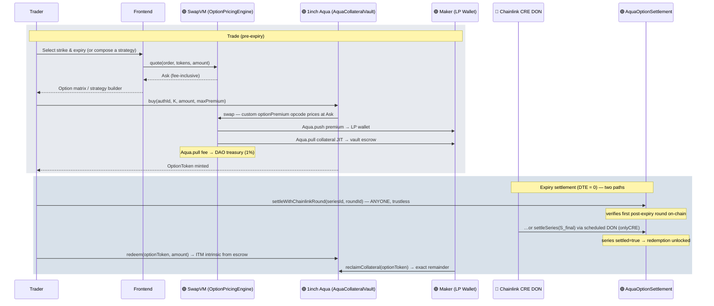
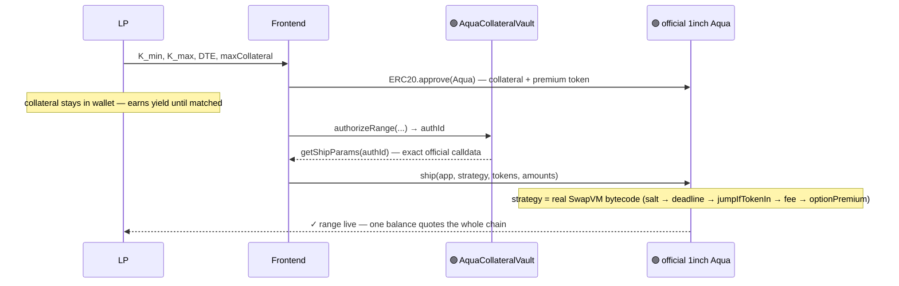
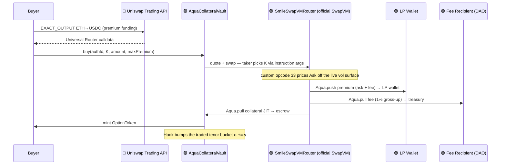
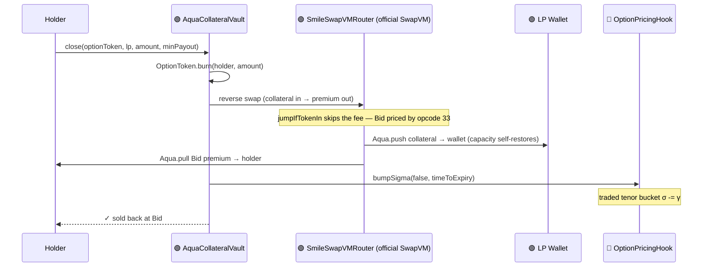
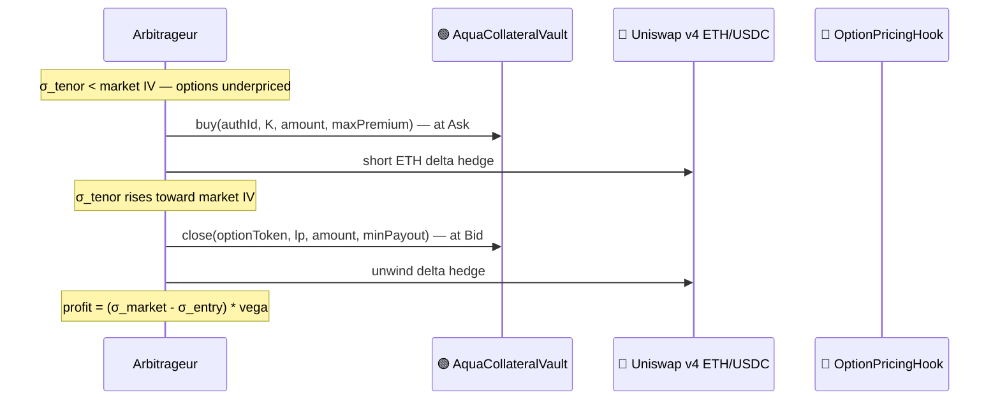
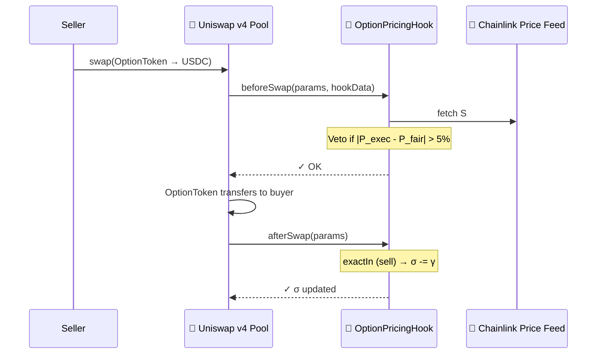
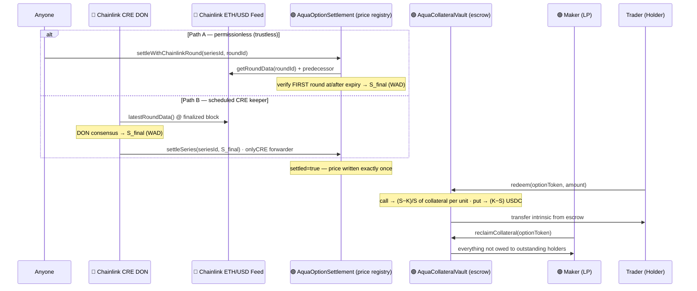

# Smile

TL;DR: Standard options market potentially as popular as Robinhood, decentralized as Polymarket.

A non-custodial, parametric options marketplace that solves three interlocking problems in DeFi options: thin liquidity at each strike, yield-killing collateral lock-up, and the absence of emergent market makers. By combining **1inch Aqua**, **Uniswap v4 Hooks**, and **Chainlink CRE**, LPs can quote an entire strike range from one capital pool — while their collateral keeps earning DeFi yield until a buyer actually matches.

---

## Table of Contents

1. [The Thesis](#-the-thesis)
2. [Architecture](#%EF%B8%8F-architecture)
3. [Mathematical Specification](#-mathematical-specification)
4. [Flow Diagrams](#-flow-diagrams)
5. [Deployed Addresses (Sepolia)](#-deployed-addresses-sepolia)
6. [How to Run the Project](#%EF%B8%8F-how-to-run-the-project)
7. [End-to-End Demo Walkthrough](#end-to-end-demo-walkthrough)
8. [Glossary](#-glossary)
9. [Project Structure](#%EF%B8%8F-project-structure)
10. [Technical Stack](#technical-stack)

More docs: [Aqua Incubator grant proposal](docs/aqua-incubator-proposal.md) ·
[build notes & war stories](docs/build-notes.md) ·
[verified CRE simulation transcript](docs/cre-simulation.md)

---

## 🚀 The Thesis

While prediction markets — binary options on event outcomes — have been widely successful in DeFi (Polymarket, Augur), standard options have not. Prediction markets do not offer many strategies retail traders have been increasingly investing in: selling covered calls to generate yield on held ETH, selling cash-secured puts to acquire ETH at a discount, buying butterflies to express a range-bound view on volatility, etc. The building blocks for this popular market requires a functioning options market with real liquidity across strikes and expiries for standard options (buys and sells of puts and calls). That market has never materialized on-chain: Ribbon and Friktion pioneered DeFi Options Vaults (DOVs) but suffer from trapped liquidity: collateral is locked per strike chosen by the vault manager, leaving the rest of the chain empty. Premia introduced RFQ-based pricing that relies on institutional market makers for quotes, creating a dependency on off-chain liquidity.

Smile attempts to overcome these limitations to on-chain standard opions trading by using Aqua's non-custodial LP to remediate:

1. Liquidity fragmentation across strikes and expiries, until a buyer is matched. Makers can offer liquidity across a range of strikes and expiries, increasing net liquidity.
2. Collateral lockup in LPs, and forfeited dividend yield — which is not a limitation of standard options writers — is also removed by Aqua's non-custodial LP.
3. Standard options markets work because broker-dealers delta-hedge their books against the spot market. Smile attempts to use the trading and settlement functionality provided by Uniswap and Chainlink to allow clever LPs and arbitrageurs to continuously arbitraging away mispricings between options and the underlying. Specifically:
   - Fast trading and premium transfer via Uniswap Trading API
   - Vol surface repricing post-trade via Uniswap v4 Hooks across strikes and expiries
   - Options payoff settlement and redemption via Chainlink CRE

---

## 🏗️ Architecture

| Layer          | Component                                     | Functionality                                                                                                                                                                                                                    |
| :------------- | :-------------------------------------------- | :------------------------------------------------------------------------------------------------------------------------------------------------------------------------------------------------------------------------------- |
| **Pricing**    | `SmileSwapVMRouter` + `OptionPricingEngine`   | Custom instruction (opcode 33) on the **official 1inch SwapVM** pricing off a **multiparameter vol surface**: σ per tenor bucket + skew, $\sigma_{strike} = \sigma_{tenor} \cdot (1 + \alpha \cdot \ln(K/S)^2 + \beta \cdot \ln(K/S))$, time-value $= S \cdot \sigma_{strike} \cdot \sqrt{T}$. The instruction is **two-sided**: forward direction prices the Ask, reverse the Bid. Oracle reads enforce Chainlink freshness. |
| **Liquidity**  | **official 1inch `Aqua`** + `AquaCollateralVault` | LP calls `authorizeRange(K_{min}, K_{max}, \text{DTE}, \text{maxCollateral})`, then ships the strategy with the official `Aqua.ship()`. On `buy()`, the SwapVM swap `Aqua.push()`es the premium into the LP wallet and `Aqua.pull()`s collateral JIT into escrow. OptionToken deployed lazily per strike. |
| **Market**     | `OptionPricingHook` + **Uniswap Trading API** | v4 Hook: `beforeSwap` vetoes mispriced trades; `afterSwap` shifts the vol surface. Trading API used for (1) live ETH/USD spot price and (2) routing the buyer's ETH→USDC premium swap via the Universal Router on each trade. |
| **Settlement** | `AquaOptionSettlement` + Chainlink CRE        | Every minted series is registered at buy time. At expiry, settlement is **permissionless**: anyone supplies the Chainlink roundId covering expiry and the contract verifies on-chain that it is the first post-expiry round (`settleWithChainlinkRound`) — no trusted writer. The scheduled CRE DON path (`settleSeries`) remains as a keeper. Holders `redeem()` the cash-settled intrinsic from the vault; LPs `reclaimCollateral()` for the exact remainder. |
| **Asset**      | `OptionToken`                                 | ERC-20 option position. Vault is owner, so can burn without allowance. Tradeable on any DEX for secondary-market price discovery.                                                                                                |

### Official 1inch Aqua + SwapVM integration

The liquidity layer runs on the **official contracts** — [`1inch/aqua`](https://github.com/1inch/aqua) and [`1inch/swap-vm`](https://github.com/1inch/swap-vm) (release/1.2), vendored under `lib/` and compiled unmodified:

- **`SmileSwapVMRouter`** (`src/swapvm/SmileSwapVMRouter.sol`) inherits the official `SwapVM` core + `AquaOpcodes` instruction set and registers one custom instruction at **opcode 33**: `_optionPremiumXD`. This router *is* the Aqua app LPs ship to.
- **The strategy is a real SwapVM program**: `salt(authId) → deadline(expiry) → optionPremium(oracle, σ-source, tokens, K-range, expiry, α)` — composed from two official `Controls` instructions plus the custom pricing opcode.
- **The taker picks the strike per swap** via SwapVM taker instruction args, so *one* shipped Aqua balance quotes the **entire option chain** in $[K_{min}, K_{max}]$ — displayed depth is a function of wallet balance, not per-strike pre-allocation.
- **Two-sided market from swap direction**: the forward direction (premium → collateral) prices at **Ask** (rounds against the taker, up); the reverse direction (collateral → premium) prices at **Bid** (rounds down). `close()` executes the reverse swap: the holder is paid the live Bid, the escrowed collateral is `Aqua.push()`ed back into the LP wallet, and the range's JIT capacity **self-restores** — the buyback funded by premiums the LP already earned.
- **Covered calls** execute as official SwapVM swaps (premium `Aqua.push()`ed to the LP wallet, collateral `Aqua.pull()`ed JIT). **Cash-secured puts** use the vault itself as an official `AquaApp` (same JIT `pull()`, under the official per-strategy reentrancy lock) since premium and collateral share one token (USDC).
- **Capacity is enforced by Aqua itself**: over-buying a range underflows the maker's virtual balance inside the official `Aqua.pull()` — the vault keeps no parallel accounting. On a mainnet fork the deploy script reuses the **production Aqua deployment** (`0x4999…6D31`).

### Revenue model (protocol fee via the official fee opcode)

Every option **buy** carries a protocol fee (default 1%, capped at 5%) that accrues to a fee recipient — e.g. the 1inch DAO treasury — routed through the **official SwapVM fee instruction**, not custom plumbing:

- The call-strategy program grows to five instructions: `salt → deadline → jumpIfTokenIn → aquaProtocolFee → optionPremium`. The official `Fee._aquaProtocolFeeAmountInXD` (opcode 28) grosses the fee up **on top of the Ask** — the buyer pays `ask + fee`, the fee recipient is paid through the official `Aqua.pull()`, and **the LP always nets the full premium**.
- The official `Controls._jumpIfTokenIn` (opcode 11) makes fees **direction-aware in bytecode**: sellbacks (collateral-in) jump past the fee instruction, so closing a position is fee-free and never double-charges.
- Puts (the vault-as-AquaApp leg) apply the identical gross-up vault-side.
- Fee terms are **snapshotted per authorization** — an LP sees the exact fee at ship time and it can never change under them; governance changes apply only to new ranges. Fee-enabled ranges ship with $25 of premium-token virtual headroom (an allowance number, no tokens move) because the official opcode pulls the fee before the buyer's premium push lands.

### Collateralization Model

**V1 (current) — Cash-Secured / Covered (Fully Collateralized)**

The simplest and safest model. To mint an ETH Call at a 3,500 strike, the LP backs it with 1 WETH (Covered Call). To mint a Put, the LP backs it with 3,500 USDC (Cash-Secured Put). The collateral is authorized JIT via Aqua — it never leaves the LP's wallet until a buyer matches — but it is always fully present and earmarked.

Solvency is trivially guaranteed: if the option expires in-the-money, the locked assets are delivered to the buyer. No price oracle is needed for margining and no liquidation engine exists — there is nothing to liquidate.

**V2 (out of scope) — Margin & Liquidation (Under-Collateralized)**

Advanced platforms like Derive allow LPs to post fractional collateral (e.g., 500 USDC to back a 3,500 ETH Call). As spot moves against the LP, the liability grows. If collateral falls below a safety threshold (e.g., 110% of the option's current market value), external liquidation bots forcibly close the position — buying back the option from the market using the LP's remaining collateral before bad debt accrues.

This model unlocks capital efficiency but requires an on-chain margin engine, a liquidation keeper network, and robust price feeds at sub-second granularity. It is explicitly out of scope for V1.

---

## 📐 Mathematical Specification

### 1. Multiparameter Volatility Surface

$$\sigma_{strike}(T) = \sigma_{tenor}(T) \cdot \max\!\big(0.1,\; 1 + \alpha \cdot \ln(K/S)^2 + \beta \cdot \ln(K/S)\big)$$

- $\sigma_{tenor}(T)$: demand-driven IV stored **per tenor bucket** — $[0,7d)$, $[7,30d)$, $[30,90d)$, $[90d,\infty)$ — the term structure of the surface (`OptionPricingHook.sigmaFor`).
- $\alpha$: smile curvature (default 2.0). OTM/ITM strikes price above the tenor σ; ATM returns it exactly.
- $\beta$: signed **skew** tilt (default 0; negative = downside/put skew, matching empirical crypto markets).
- The multiplier is floored at 0.1 so deep wings can never collapse σ to zero.

### 2. Premium Calculation

$$P = \underbrace{\max(\pm(S - K),\, 0)}_{\text{intrinsic (call/put)}} + \underbrace{S \cdot \sigma_{strike} \cdot \sqrt{T} \cdot \tfrac{\min(S,K)}{\max(S,K)}}_{\text{moneyness-damped time-value}}$$

- **Ask** (forward swap direction, opening): rounds against the taker (up).
- **Bid** (reverse direction, sellback): rounds down. One strategy quotes both sides; the rounding asymmetry is the spread engine.
- A protocol fee (default 1%) is grossed up **on top of** the Ask via the official SwapVM fee opcode — the LP always nets the full premium. Sellbacks are fee-free.

Gas-efficient on-chain approximation — omits $N(d_1)$ and $N(d_2)$ to avoid square-root-heavy distributions.

### 3. σ Feedback Loop (tenor-aware)

$$\sigma_{tenor,\,t+1} = \sigma_{tenor,\,t} + \gamma \cdot \text{sign}(\text{trade})$$

- $+\gamma$ on every `buy()` — bumps **only the traded tenor bucket**.
- $-\gamma$ on every `close()` sellback — decays the same bucket.
- Uniswap v4 `afterSwap` (no tenor info) shifts the whole surface.
- $\gamma = 0.5\%$ per trade. This creates a price-impact-like mechanism: heavy buying steepens the surface and raises premiums, attracting arbitrageurs who sell back to earn the spread.

> **Design note — why pricing is on-chain, and why $\sigma_{tenor}$ is a step function.**
> `OptionPricingHook.sigmaFor` is read **atomically inside the same swap** that buys or
> sells the option, so the price a trader gets is exactly whatever the bucket lookup
> returns at that block — no off-chain quote to go stale or be front-run. This isn't
> architecturally required: `AquaOptionSettlement` already sources its *expiry* price
> off-chain via the Chainlink CRE forwarder (§5), so an RFQ-style premium quote (a
> signed off-chain price, verified on-chain much like a CRE report) is possible in
> principle. The tradeoff:
> - **On-chain step lookup (current):** fully permissionless and atomic, no quoting
>   service to keep live — but $\sigma_{tenor}(T)$ is discontinuous at the 7d/30d/90d
>   bucket edges (visible as terraces on the Vol Surface tab), and each trade can only
>   afford to move the one bucket it landed in.
> - **Off-chain quoted pricing:** could interpolate $\sigma_{tenor}(T)$ smoothly across
>   tenors, but reintroduces a liveness/trust dependency on the quoter, and blending a
>   trade's demand feedback across neighboring buckets (instead of bumping one bucket)
>   opens a manipulation surface — trading right at a bucket edge could nudge a bucket
>   nothing actually traded in.
>
> V1 keeps pricing on-chain and discrete; smooth interpolation is left for a future
> RFQ-style quoting layer.

### 4. Black-Scholes Delta (Frontend)

Delta ($\Delta$) is computed client-side for the matrix display. Not used in on-chain pricing.

$$\Delta = N(d_1), \qquad d_1 = \frac{\ln(S/K) + \frac{1}{2}\sigma_{strike}^2 \cdot T}{\sigma_{strike} \cdot \sqrt{T}}$$

$N(\cdot)$ is approximated via Abramowitz & Stegun 26.2.17 (max error $1.5 \times 10^{-7}$, no lookup tables). $\sigma_{strike}$ from §1 is used — ensuring delta reflects the vol surface curvature, not flat vol.

> Delta ranges 0–1 for calls (0 = deep OTM, 1 = deep ITM). A 0.5-delta call is approximately ATM.

### 5. Expiry Settlement — Permissionless + Chainlink CRE

A parametric option is only as trustworthy as the price it settles against. At expiry every open series needs one **final spot price** $S_{final}$ written on-chain, because that single number decides every payout: holders redeem the in-the-money intrinsic and the LP reclaims the remainder (see [§6 flow](#6-settlement--redemption)). Every series is registered with `AquaOptionSettlement` at first mint, and can then be settled by **either of two paths**:

**Path A — permissionless Chainlink-round settlement (trustless).** Anyone — a keeper, the holder, the LP — calls `settleWithChainlinkRound(seriesId, roundId)` with the Chainlink ETH/USD round covering expiry. The contract verifies on-chain that the round was updated **at/after expiry** and that its predecessor was updated **before** expiry (i.e. it is the *first* post-expiry round), so nobody can cherry-pick a later, more favorable price:

$$S_{final} = \mathtt{getRoundData(roundId).answer} \;\; (\text{8-dec}) \;\rightarrow\; \text{WAD 18-dec}$$

No trusted writer exists on this path — settlement liveness reduces to the feed's.

**Path B — Chainlink CRE (scheduled keeper).** A CRE *cron trigger* fires the settlement workflow at expiry: the DON reads the same aggregator at the last *finalized* block (every node observes an identical value), reaches consensus, and the DON-signed report calls `settleSeries(seriesId, S_final)` through the CRE forwarder — so a series settles on schedule even if nobody races to call Path A.

In short: 1inch Aqua holds the collateral, Uniswap prices and routes the trade, and settlement is **available trustlessly to anyone** with Chainlink CRE as the scheduled closer.

> **Design note.** Because both paths resolve to the on-chain Chainlink feed, the DON's role is a *scheduled, trust-minimized keeper* (deterministic read + signed write) rather than novel off-chain data sourcing.

---

## 🔄 Flow Diagrams

> Color key: 🟢 1inch Aqua · 🩷 Uniswap · 🔵 Chainlink

### 0. System Overview



### 1. Range Authorization + Ship (LP)

The LP authorizes a strike range from one collateral pool, then ships it on the **official Aqua registry**. No collateral moves at any stage — it stays in the LP's wallet earning yield; `Aqua.ship()` only records virtual balances.



### 2. Primary Market Buy (Trader)

Premium payment is routed through the **Uniswap Trading API** (`EXACT_OUTPUT` ETH→USDC), giving an on-chain Uniswap tx before the vault call.



### 3. Close Position = Sellback at Bid (Holder)

A holder exits before expiry by **selling the option back at the live Bid** — a *reverse* swap through the same shipped SwapVM strategy. Escrowed collateral returns to the LP wallet via `Aqua.push()`, which **restores the range's JIT capacity**; the Bid premium is `Aqua.pull()`ed from the LP wallet straight to the holder (funded by premiums the LP already earned). Sellbacks are fee-free — the strategy bytecode jumps past the fee opcode in the reverse direction. This is also the path arbitrageurs use to monetize σ corrections.



### 4. Arbitrageur as Emergent Market Maker

When on-chain σ diverges from market IV, arbitrageurs capture the spread by buying at the Ask, delta-hedging on spot, and **selling back at the Bid** once their own demand re-rates σ. The sellback mechanism is what makes the round trip monetizable — their activity *is* the correction. This is the emergent market-making loop.



### 5. Secondary Market Swap (Uniswap v4)

Existing OptionTokens can be resold. The hook vetoes mispriced swaps and adjusts σ. Secondary market only — ERC-20 ownership transfers, no minting.



### 6. Settlement & Redemption

Every series is registered at first mint. At expiry it settles through either path — **permissionlessly** with the Chainlink round covering expiry (verified on-chain, no trusted writer), or via the scheduled **CRE DON**. Holders then redeem the cash-settled intrinsic from the vault's escrow; the LP reclaims the exact remainder — in any order, with full conservation.



---

## 📍 Deployed Addresses (Sepolia)

> ⚠️ **Stale — v1 deployment.** These are the original hackathon contracts, deployed
> **before** the official Aqua/SwapVM integration, the two-sided sellback, trustless
> settlement, and the protocol fee. Their ABIs are incompatible with the current
> frontend; a redeploy of the new stack (Aqua, `SmileSwapVMRouter`, oracle, vault,
> settlement) is pending. Until then, use the [local Anvil path](#4-deploy-to-anvil-local),
> which deploys and exercises everything.

| Contract                 | Address                                                                                                                         |
| ------------------------ | ------------------------------------------------------------------------------------------------------------------------------- |
| **OptionPricingEngine**  | [`0x3f5a5b1972Ddac7E81fdf7F6AEFC2633Fa8FF532`](https://sepolia.etherscan.io/address/0x3f5a5b1972Ddac7E81fdf7F6AEFC2633Fa8FF532) |
| **OptionPricingHook**    | [`0x15578B9248b574194867Ab204bE4161213Acf194`](https://sepolia.etherscan.io/address/0x15578B9248b574194867Ab204bE4161213Acf194) |
| **AquaCollateralVault**  | [`0x5115fbdb810D1dB316034fF670c65c45d875f887`](https://sepolia.etherscan.io/address/0x5115fbdb810D1dB316034fF670c65c45d875f887) |
| **AquaOptionSettlement** | [`0x5c9E7BB8db084A955acD519f61287d24Ff24F211`](https://sepolia.etherscan.io/address/0x5c9E7BB8db084A955acD519f61287d24Ff24F211) |
| **USDC** (Circle Sepolia) | [`0x1c7D4B196Cb0C7B01d743Fbc6116a902379C7238`](https://sepolia.etherscan.io/address/0x1c7D4B196Cb0C7B01d743Fbc6116a902379C7238) |
| **WETH** (canonical Sepolia) | [`0x7b79995e5f793A07Bc00c21412e50Ecae098E7f9`](https://sepolia.etherscan.io/address/0x7b79995e5f793A07Bc00c21412e50Ecae098E7f9) |

> _Frontend deployed at **https://oslinin.github.io/Smile** (WalletConnect enabled). The live site currently targets the v1 contracts above — on-chain interactions there will work again after the Sepolia redeploy._

---

## 🛠️ How to Run the Project

### 1. View Live Site (GitHub Pages)

**URL:** `https://oslinin.github.io/Smile`

### 2. Local Frontend Development

```bash
cd frontend
pnpm install
pnpm run dev
```

Or, from the repo root (no `cd` needed — pnpm targets the workspace by name):

```bash
pnpm --filter frontend dev
```

Open http://localhost:3000. The UI includes the option-chain matrix, the LP
range-authorization flow, and an OptionStrat-style **strategy builder** —
20 named strategies (spreads, condors, butterflies, straddles, backspreads,
calendars) grouped by market outlook, with up to 6 custom legs, per-leg expiry,
a T+0 value curve, breakevens, probability of profit, and net greeks. Entry
premiums are quoted with the same smile the on-chain instruction charges, so
what you see is what `vault.buy()` costs.

The **Vol Surface · Python** tab renders the live 3-D volatility surface
$\sigma_{strike}(K,T)$ with **matplotlib** (a Flask service in
[`volsurface/`](volsurface/)). Every confirmed buy/sell POSTs to the renderer,
which bumps the traded tenor bucket by $\pm\gamma$ — the same feedback loop the
on-chain [`OptionPricingHook.bumpSigma`](src/hooks/OptionPricingHook.sol) applies
— so the surface visibly re-rates as order flow arrives. Start it standalone with
`./volsurface/run.sh` (it also comes up automatically with `./local.sh`); the tab
shows a hint instead of a broken image when the service is offline.

### 3. Smart Contract Development (Foundry)

```bash
forge build   # compile all contracts (incl. the vendored official 1inch stack)
forge test    # run the 82-test suite
```

### 4. Deploy to Anvil (Local)

The quickest path: `./local.sh` starts Anvil, deploys all contracts, writes `frontend/.env.local`, launches the vol-surface renderer, and starts the dev server in one step.

When you're done, stop everything it started:

```bash
fuser -k 8545/tcp 3000/tcp 8000/tcp
```

(This is the same port-based cleanup `local.sh` runs on every invocation, so it's safe even if a previous run didn't finish cleanly — unlike `kill $(cat /tmp/*-options.pid)`, it won't error out on a missing PID file.)

Re-running `./local.sh` also stops any previous instances automatically before starting fresh.

To deploy manually (e.g., to iterate on the script):

```bash
# Terminal 1 — start Anvil
anvil --chain-id 31337 --block-time 1 --port 8545

# Terminal 2 — deploy (uses Anvil's pre-funded account 0)
PRIVATE_KEY=0xac0974bec39a17e36ba4a6b4d238ff944bacb478cbed5efcae784d7bf4f2ff80 \
  forge script script/Deploy.s.sol:Deploy \
  --rpc-url http://localhost:8545 \
  --broadcast \
  --skip-simulation
```

### 5. Deploy to Sepolia

Copy `.env.example` → `.env`, fill in `PRIVATE_KEY` and `RPC_SEPOLIA`, then:

```bash
source .env
PRIVATE_KEY="$PRIVATE_KEY" \
FEE_RECIPIENT="$FEE_RECIPIENT" \
forge script script/Deploy.s.sol:Deploy \
  --rpc-url "$RPC_SEPOLIA" \
  --broadcast
```

`FEE_RECIPIENT` is where the 1% protocol fee accrues (e.g. a DAO treasury); it
defaults to the deployer if unset. The script outputs `NEXT_PUBLIC_*` addresses;
copy them into `frontend/.env.local` (or set `NEXT_PUBLIC_CHAIN_ID=11155111`).

To verify contracts on Etherscan at the same time:

```bash
source .env
PRIVATE_KEY="$PRIVATE_KEY" forge script script/Deploy.s.sol:Deploy \
  --rpc-url "$RPC_SEPOLIA" \
  --broadcast \
  --verify \
  --etherscan-api-key "$ETHERSCAN_API_KEY"
```

### 6. Chainlink CRE Workflow

The required Chainlink integration is a **CRE workflow** that performs an on-chain
state change: on a cron schedule the DON reads the Chainlink ETH/USD feed at the
last finalized block, reaches consensus, and the DON-signed report calls
`AquaOptionSettlement.settleSeries(seriesId, spotPrice)` on-chain.

| File | Role |
| ---- | ---- |
| [`cre-workflow/settlement/workflow.ts`](cre-workflow/settlement/workflow.ts) | The workflow itself — cron trigger → `callContract(latestRoundData)` on the Chainlink feed → DON consensus → DON-signed `writeReport` → `settleSeries()`. Compiles to WASM. |
| [`cre-workflow/settlement/config.json`](cre-workflow/settlement/config.json) | Runtime config: `schedule`, `seriesId`, target `settlementAddress`, `priceFeedAddress` (Chainlink ETH/USD), `gasLimit`, and chain selector. |
| [`cre-workflow/settlement/package.json`](cre-workflow/settlement/package.json) | Deps + `typecheck` script. Build + simulate run via the **`cre` CLI** (`cre workflow build\|simulate settlement`). |

> **Access control.** `settleSeries()` carries an `onlyCRE` modifier
> ([AquaOptionSettlement.sol:38](src/vaults/AquaOptionSettlement.sol#L38)) — only the
> CRE forwarder address passed to the constructor at deploy time can write the
> settlement price. The simulator uses a local forwarder; the live path requires the
> contract to be deployed with your registered CRE forwarder address.

#### Prerequisites

The current CRE CLI (v1.20.x) reworks several commands; this workflow is pinned to
**v1.11.0** to match `@chainlink/cre-sdk@^1.11.0`. The CLI is a binary installed via
Chainlink's official script (it is **not** an npm package).

```bash
# 1. CRE CLI v1.11.0 — installs to ~/.cre/bin and appends it to PATH in ~/.bashrc.
curl -sSL https://app.chain.link/cre/install.sh | bash -s -- v1.11.0
source ~/.bashrc          # or open a new shell, so `cre` is on PATH
cre version               # → CRE CLI version v1.11.0

# 2. Bun ≥ 1.0 — cre-compile uses it to build the WASM target.
curl -fsSL https://bun.sh/install | bash

# 3. Authenticate — required even for local simulation.
cre login                 # opens a browser; or, non-interactively:
# echo 'CRE_API_KEY=<key from Account Settings at https://app.chain.link>' >> cre-workflow/.env

# 4. Install workflow + contract-binding deps (each folder has its own package.json).
cd cre-workflow
( cd settlement && bun install )
( cd contracts  && bun install )

# 5. (Optional) Regenerate the typed contract binding from the Foundry ABI.
#    Already committed under contracts/evm/ts/generated/; only needed if the ABI changes.
cp ../out/AquaOptionSettlement.sol/AquaOptionSettlement.json contracts/evm/src/abi/
cre generate-bindings evm --language typescript
```

Edit [`cre-workflow/settlement/config.json`](cre-workflow/settlement/config.json) so `seriesId` matches the
series you registered on-chain (copy it from the **On-Chain Proof** tab or from the
`forge script` deploy logs), `evm.settlementAddress` points at your deployed
`AquaOptionSettlement`, and `evm.priceFeedAddress` is the Chainlink ETH/USD feed for the
chain (Sepolia: `0x694AA1769357215DE4FAC081bf1f309aDC325306`). The active CRE target is
read from `CRE_TARGET` in `cre-workflow/.env` (`staging-settings` → Sepolia RPC in
[`project.yaml`](cre-workflow/project.yaml)).

> **Build needs no auth; simulate does.** `cre workflow build` compiles the WASM
> locally. `cre workflow simulate` gates on auth — run `cre login` (or set
> `CRE_API_KEY`) first.

---

### 6a. Demonstrate a successful CRE CLI simulation (the verified path)

First confirm it compiles (no auth needed):

```bash
cd cre-workflow
cre workflow build settlement
# ✓ Workflow compiled successfully
# ✓ Build output written to settlement/binary.wasm
```

Then run the simulation. The simulator spins up a local CRE runtime, fires the cron
trigger, runs the workflow's on-chain feed read + DON consensus, and signs the report —
all against the Sepolia RPC from `project.yaml`:

```bash
cre workflow simulate settlement --non-interactive --trigger-index 0
# `--non-interactive --trigger-index 0` selects the single cron trigger;
# omit both to pick it from an interactive menu.
```

Verified: CLI v1.11.0 reads the live Sepolia ETH/USD feed, runs DON consensus and
signs the report, exiting `0`. Full annotated transcript: [docs/cre-simulation.md](docs/cre-simulation.md).

> **Note — live broadcast is out of scope here.** CRE delivers DON-signed reports through
> a KeystoneForwarder that calls `onReport(bytes,bytes)` on the receiver, whereas
> `AquaOptionSettlement` exposes a plain `settleSeries(bytes32,uint256)` guarded by
> `onlyCRE`. Wiring the live on-chain write (an `onReport` entrypoint + registered
> forwarder) is a follow-up; the CRE CLI **simulation above** is the demonstrated path.

---

## End-to-End Demo Walkthrough

| Step | Actor  | Action                                                                     | Contract call                                              |
| ---- | ------ | -------------------------------------------------------------------------- | ---------------------------------------------------------- |
| 1    | LP     | Connect wallet → _Authorize Strike Range_ → approve **official Aqua** → register → **ship** | `ERC20.approve(Aqua)` + `AquaCollateralVault.authorizeRange()` + `Aqua.ship()` |
| 2    | Trader | Click **Buy** on a strike within LP's range → approve USDC → buy           | `ERC20.approve(USDC)` + `AquaCollateralVault.buy(authId, K, amount, maxPremium)` (SwapVM-priced, 1% fee → DAO) |
| 2a   | Trader | Compose a multi-leg position in the **Strategy Builder** (20 named strategies or custom legs) — each buy leg is a `vault.buy()` | frontend only — payoff, T+0 curve, greeks, POP |
| 3    | Trader | Click **Close** to sell back at the live Bid (reverse SwapVM swap; LP capacity restores) | `AquaCollateralVault.close(optionToken, lp, amount, minPayout)` |
| 4    | —      | Settle at expiry — **anyone** may supply the Chainlink round covering expiry; or run `cre workflow simulate settlement` | `AquaOptionSettlement.settleWithChainlinkRound()` / `settleSeries()` via CRE |
| 5    | Trader | Call `redeem()` to collect the cash-settled intrinsic (ITM only)           | `AquaCollateralVault.redeem(optionToken, amount)`          |
| 6    | LP     | Call `reclaimCollateral()` to recover everything not owed to holders       | `AquaCollateralVault.reclaimCollateral(optionToken)`       |

---

## 📖 Glossary

### Ethereum / Blockchain Terms

- **EOA (Externally Owned Account):** A standard Ethereum wallet controlled by a private key (e.g., MetaMask). LPs and traders use EOAs; the protocol never takes custody of their funds.
- **ERC-20:** Standard interface for fungible tokens. `OptionToken` follows this standard so positions can be resold on any DEX.
- **Non-custodial:** The protocol never holds user assets. Collateral stays in LP wallets until a buyer matches; the vault only moves funds atomically on match.

### DeFi Terms

- **LP (Liquidity Provider):** A participant who backs trades. Here, LPs authorize the vault to pull collateral JIT — they are yield-seeking covered-option writers, not market makers.
- **Maker:** The option writer (LP). Authorizes a strike range, provides collateral JIT, receives premiums, reclaims collateral at expiry.
- **Trader:** The option buyer. Pays premium, receives an OptionToken representing the long position, redeems ITM payout at settlement.
- **CEX (Centralized Exchange):** Off-chain exchange (Binance, Coinbase, Kraken). Referenced as real-world ETH/USD price sources; the live frontend spot is sourced via the Uniswap Trading API, while settlement reads the on-chain Chainlink feed.
- **DEX (Decentralized Exchange):** On-chain exchange. Uniswap v4 provides secondary-market trading for OptionTokens.
- **DON (Decentralized Oracle Network):** A tamper-resistant network of node operators that securely delivers external data to smart contracts (Chainlink).
- **CRE (Chainlink Runtime Environment):** Off-chain computation environment for custom DON workflows (successor to Chainlink Functions).
- **JIT (Just-In-Time) Liquidity:** Capital pulled from an LP's wallet only at trade execution — never locked idle. Enabled by 1inch Aqua.

### Options Terms

- **Delta (Δ):** Rate of change of premium per $1 move in spot. 0 = deep OTM, 1 = deep ITM for calls. Computed frontend-only via $N(d_1)$ using smile-adjusted $\sigma_{strike}$.
- **Strike Price (K):** Price at which the option holder has the right to buy (call) or sell (put) at expiry.
- **Spot Price (S):** Current market price of ETH/USDC, sourced from Chainlink.
- **DTE (Days to Expiry):** Time remaining until settlement, in days.
- **K_min / K_max:** The lower and upper bounds of an LP's authorized strike range.
- **OTM (Out-of-The-Money):** No intrinsic value at expiry; LP reclaims 100% of collateral.
- **ITM (In-The-Money):** Intrinsic value at expiry; holder receives payout, LP gets remainder.
- **IV (Implied Volatility / σ):** Market's forecast of price movement. Stored per tenor bucket (`sigmaFor`), demand-weighted, adjusting with every trade.
- **Volatility Smile:** OTM/ITM options trade at higher IV than ATM; modeled by $\alpha \cdot \ln(K/S)^2$ curvature.
- **Black-Scholes:** Mathematical option pricing model. This protocol uses a parametric approximation (gas-efficient, no $N(d_1)$ on-chain).

### Protocol-Specific Terms

- **Range Authorization:** LP's single on-chain commitment to write options at any strike $K \in [K_{min}, K_{max}]$ from one collateral pool. First buy at a new strike deploys an OptionToken lazily.
- **Yield Double-Dip:** LP earns staking/lending yield on collateral (because it stays in their wallet via Aqua JIT) _and_ option premium from buyers. Impossible in vault-locking designs.
- **Vol Surface / σ Feedback Loop:** IV is stored per tenor bucket with a skew tilt. Every buy bumps the traded bucket up; every sellback decays it. Creates on-chain price discovery that arbitrageurs can trade against.
- **Emergent Market Maker:** An arbitrageur who buys underpriced options (low $\sigma_{tenor}$) at the Ask, delta-hedges on Uniswap, and sells back at the Bid when σ corrects — capturing the spread while enforcing IV consistency.
- **Covered Call / Cash-Secured Put:** Fully collateralized option: WETH backs calls (LP delivers ETH if exercised), USDC backs puts (LP purchases ETH if exercised). No naked writing; collateral IS the hedge.
- **SwapVM:** 1inch highly-optimized VM for custom matching and pricing logic.
- **1inch Aqua:** 1inch primitive for JIT transfer of assets from LP self-custodial wallets.
- **Uniswap v4 Hooks:** Smart contracts at swap lifecycle points: `beforeSwap` vetoes mispriced trades, `afterSwap` adjusts IV.
- **`latestRoundData()`:** The Chainlink aggregator read returning the latest ETH/USD answer (8-decimal). CRE reads it at the last finalized block so every DON node agrees on the settlement price.

---

## 🏗️ Project Structure

```text
├── lib/                      # Vendored official contracts (compiled unmodified)
│   ├── aqua/                 # 1inch/aqua — registry, AquaApp base, IAqua
│   ├── swap-vm/              # 1inch/swap-vm release/1.2 — VM core, opcodes, routers
│   └── forge-std/            # forge-std v1.11.0
├── src/                      # Smile contracts (Solidity 0.8.30)
│   ├── swapvm/               # SmileSwapVMRouter (opcode 33) + OptionPremiumInstruction
│   │                         #   + SmileMath + OptionPricingEngine (quoting facade)
│   ├── vaults/               # AquaCollateralVault (escrow/lifecycle)
│   │                         #   + AquaOptionSettlement (expiry-price registry)
│   ├── hooks/                # OptionPricingHook (Uniswap v4 + the vol surface)
│   ├── mocks/                # MockV3Aggregator (local Chainlink feed)
│   └── OptionToken.sol       # ERC-20 option position
├── frontend/                 # Next.js app
│   ├── components/           # OptionMatrix, AuthorizeRange, PayoffBuilder, LPDashboard, VolSurface
│   ├── lib/                  # options engine + 20-strategy catalog
│   └── config/               # Wagmi + contract addresses + official Aqua ABI
├── volsurface/               # Python (Flask + matplotlib) 3-D vol-surface renderer
│                             #   — evolves with each trade via the σ feedback loop
├── cre-workflow/             # Chainlink CRE workflow (TypeScript → WASM)
├── script/                   # Deploy.s.sol + DemoTrade.s.sol (live-node demo)
├── docs/                     # grant proposal, build notes, CRE transcript
├── test/                     # Foundry tests (82 passing)
└── foundry.toml              # solc 0.8.30, via_ir
```

---

## Technical Stack

- **Smart Contracts**: Solidity 0.8.30 (Foundry, via_ir), on the **official 1inch Aqua + SwapVM** contracts (vendored, unmodified)
- **Frontend**: Next.js 16, Tailwind CSS, Wagmi/Viem, recharts; strategy engine built on the MIT `black-scholes` + `greeks` packages
- **Oracle/Settlement**: Chainlink price feeds (permissionless round-verified settlement) + Chainlink CRE SDK (scheduled keeper)
- **DEX Infrastructure**: Uniswap v4 Hooks, Uniswap Trading API

---

_Built for the 1inch + Uniswap + Chainlink Hackathon._
