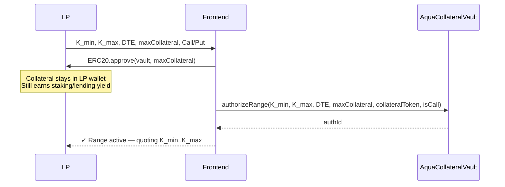
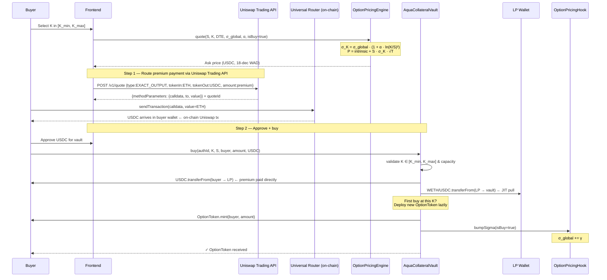
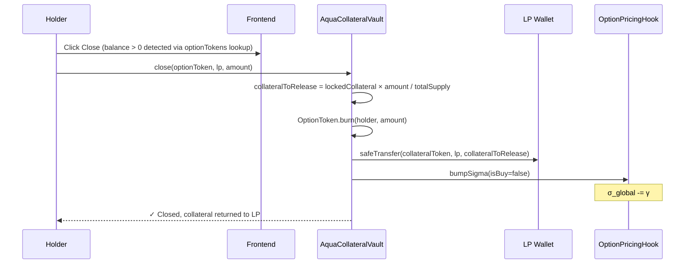
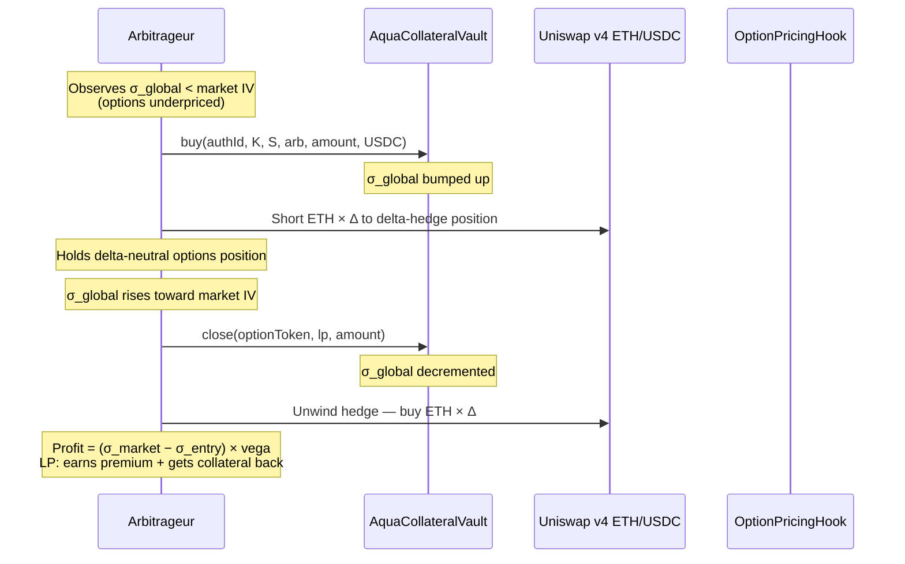
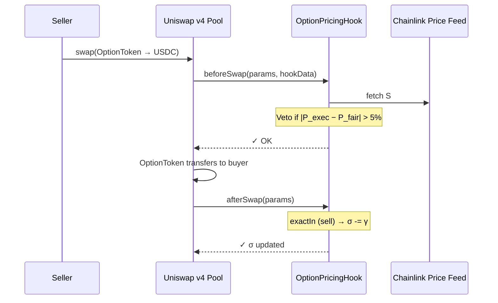

# Parametric Options Marketplace

A non-custodial, parametric options marketplace that solves three interlocking problems in DeFi options: thin liquidity at each strike, yield-killing collateral lock-up, and the absence of emergent market makers. By combining **1inch Aqua**, **Uniswap v4 Hooks**, and **Chainlink CRE**, LPs can quote an entire strike range from one capital pool — while their collateral keeps earning DeFi yield until a buyer actually matches.

---

## Table of Contents

1. [The Thesis](#-the-thesis)
2. [Architecture](#%EF%B8%8F-architecture)
3. [Mathematical Specification](#-mathematical-specification)
4. [Flow Diagrams](#-flow-diagrams)
5. [Deployed Addresses (Sepolia)](#-deployed-addresses-sepolia)
6. [Deployment Notes & Failures](#%EF%B8%8F-deployment-notes--failures)
7. [How to Run the Project](#%EF%B8%8F-how-to-run-the-project)
8. [End-to-End Demo Walkthrough](#end-to-end-demo-walkthrough)
9. [Glossary](#-glossary)
10. [Project Structure](#%EF%B8%8F-project-structure)
11. [Technical Stack](#technical-stack)
12. [Foundry Usage](#foundry-usage)

---

## 🚀 The Thesis

DeFi options have never worked at scale. Three compounding failures explain why:

**1. Capital fragmentation.** Protocols like Ribbon and Friktion ask LPs to commit collateral to a specific strike-expiry pair before anyone has even asked for that option. Capital sits inert across dozens of sparsely-traded series. We replace per-strike registration with **range authorization**: an LP authorizes "I will write covered calls at any strike between $3,000 and $4,000" backed by one collateral pool. OptionTokens are deployed lazily the first time a buyer hits a given strike. Capital concentrates instead of fragmenting.

**2. The yield kill.** The deeper problem: locking collateral in a vault forfeits yield. A covered call writer in TradFi still receives dividends on the underlying. A vault-locked DeFi LP loses staking rewards, lending yield, and any LPing returns for the entire option duration. With **1inch Aqua JIT**, LP collateral stays in the LP's own wallet — earning staking or lending yield — and is pulled on-chain only at the moment a buyer matches. The LP collects both: yield on the collateral *and* the option premium. This is the **yield double-dip**, and it is impossible with a traditional vault design.

**3. No emergent market makers.** Ribbon vaults have no mechanism for price discovery. Our protocol has `σ_global`, a demand-weighted implied volatility parameter. Every buy bumps σ up; every close or secondary-market sell nudges σ down. A sophisticated LP or arbitrageur who observes that on-chain σ is below market IV can buy underpriced options in the primary market, delta-hedge on the Uniswap v4 spot pool, and close when σ re-equilibrates — capturing the spread while tightening the market. Arbitrageurs thus become emergent market makers, organically enforcing consistency between the primary options market and the secondary spot market.

---

## 🏗️ Architecture

| Layer | Component | Functionality |
| :--- | :--- | :--- |
| **Pricing** | `OptionPricingEngine` | Stateless parametric premium: $\sigma_{strike} = \sigma_{global} \cdot (1 + \alpha \cdot \ln(K/S)^2)$, time-value $= S \cdot \sigma_{strike} \cdot \sqrt{T}$. |
| **Liquidity** | `AquaCollateralVault` | LP calls `authorizeRange(K_{min}, K_{max}, \text{DTE}, \text{maxCollateral})`. On `buy()`, collateral is pulled JIT from LP wallet; premium flows buyer → LP directly. OptionToken deployed lazily per strike. |
| **Market** | `OptionPricingHook` + **Uniswap Trading API** | v4 Hook: `beforeSwap` vetoes mispriced trades; `afterSwap` adjusts $\sigma_{global}$. Trading API used for (1) live ETH/USD spot price and (2) routing the buyer's ETH→USDC premium swap via the Universal Router on each trade. |
| **Settlement** | `AquaOptionSettlement` + Chainlink CRE | DON consensus (trimmed mean across Binance/Coinbase/Kraken) writes $S_{final}$ on-chain; holders redeem ITM payouts. |
| **Asset** | `OptionToken` | ERC-20 option position. Vault is owner, so can burn without allowance. Tradeable on any DEX for secondary-market price discovery. |

---

## 📐 Mathematical Specification

### 1. Parametric Volatility Smile

$$\sigma_{strike} = \sigma_{global} \cdot (1 + \alpha \cdot \ln(K/S)^2)$$

- $\sigma_{global}$: demand-weighted baseline IV, adjusted by every primary-market trade and secondary-market swap.
- $\alpha$: smile curvature (default 2.0). OTM/ITM strikes price above $\sigma_{global}$; ATM returns $\sigma_{global}$ exactly.
- $K/S$: moneyness ratio.

### 2. Premium Calculation

$$P = \underbrace{\max(S - K,\, 0)}_{\text{intrinsic}} + \underbrace{S \cdot \sigma_{strike} \cdot \sqrt{T}}_{\text{time-value}}$$

- **Ask (buy):** rounds up 1 wei.
- **Bid (sell):** floor.

Gas-efficient on-chain approximation — omits $N(d_1)$ and $N(d_2)$ to avoid square-root-heavy distributions.

### 3. σ Feedback Loop

$$\sigma_{global,\,t+1} = \sigma_{global,\,t} + \gamma \cdot \text{sign}(\text{trade})$$

- $+\gamma$ on every `buy()` or secondary-market `exactOut` swap (demand signal).
- $-\gamma$ on every `close()` or secondary-market `exactIn` swap (supply signal).
- $\gamma = 0.5\%$ per trade. This creates a price-impact-like mechanism: heavy buying steepens the smile and raises premiums, attracting arbitrageurs who sell/close to earn the spread.

### 4. Black-Scholes Delta (Frontend)

Delta ($\Delta$) is computed client-side for the matrix display. Not used in on-chain pricing.

$$\Delta = N(d_1), \qquad d_1 = \frac{\ln(S/K) + \frac{1}{2}\sigma_{strike}^2 \cdot T}{\sigma_{strike} \cdot \sqrt{T}}$$

$N(\cdot)$ is approximated via Abramowitz & Stegun 26.2.17 (max error $1.5 \times 10^{-7}$, no lookup tables). $\sigma_{strike}$ from §1 is used — ensuring delta reflects the vol surface curvature, not flat vol.

> Delta ranges 0–1 for calls (0 = deep OTM, 1 = deep ITM). A 0.5-delta call is approximately ATM.

### 5. Chainlink CRE Consensus Settlement

$$S_{final} = \frac{1}{m} \sum_{x \in \mathcal{X}_{trimmed}} x, \qquad \mathcal{X}_{trimmed} = \begin{cases} \{x_2, \dots, x_{n-1}\} & n \ge 3 \\ \{x_1, \dots, x_n\} & n < 3 \end{cases}$$

DON fetches $n$ prices from Binance, Coinbase, Kraken; trims outliers; writes trimmed mean on-chain via `settleSeries()`.

---

## 🔄 Flow Diagrams

### 1. Range Authorization (LP)

The LP authorizes a strike range from one collateral pool. No collateral moves at this stage — it stays in the LP's wallet earning yield. The LP also pre-approves the vault to spend up to `maxCollateral` JIT.



### 2. Primary Market Buy (Trader) — Uniswap Trading API

The frontend uses the **Uniswap Trading API** (`trade-api.gateway.uniswap.org/v1/quote`) for two purposes: (1) live ETH/USD spot price displayed in the header, and (2) routing the premium payment on-chain when a buyer purchases an option. The buyer pays in ETH; the Trading API finds the optimal route to deliver the exact USDC amount needed, then the Universal Router executes the swap on-chain. This gives a real Uniswap transaction hash as evidence of execution.



### 3. Close Position / Early Unwind (Holder)

A holder unwinds before expiry. Vault burns their tokens, returns collateral to LP pro-rata, and decrements σ. This path is also exercised by arbitrageurs closing delta-hedged positions.



### 4. Arbitrageur as Emergent Market Maker

When on-chain σ diverges from market IV, arbitrageurs can capture the spread by buying the primary market and hedging on spot. Their close activity re-equilibrates σ_global. This is the emergent market-making loop.



### 5. Secondary Market Swap (Uniswap v4)

Existing OptionTokens can be resold. The hook vetoes mispriced swaps and adjusts σ. Secondary market only — ERC-20 ownership transfers, no minting.



### 6. Settlement & Redemption (Chainlink CRE)

At expiry, the CRE DON fetches $S$ from multiple CEXs, computes trimmed-mean consensus, and calls `settleSeries()`. Holders redeem ITM payouts; LP reclaims remaining collateral.

```mermaid
sequenceDiagram
    participant CRE as Chainlink CRE DON
    participant Feeds as Price Feeds (Binance, Coinbase, Kraken)
    participant Settlement as AquaOptionSettlement
    participant Holder
    participant LP

    CRE->>CRE: Triggered at DTE=0 (cron 0 */6 * * *)
    CRE->>Feeds: fetch S
    Feeds-->>CRE: [S_a, S_b, S_c]
    Note over CRE: trimmed mean → S_final
    CRE->>Settlement: settleSeries(seriesId, S_final)
    Note over Settlement: settled=true, S_final recorded
    Holder->>Settlement: redeem(seriesId, amount)
    Note over Settlement: ITM: payout=(S_final−K)×amount; OTM: 0
    Settlement->>Holder: safeTransfer — payout
    LP->>Settlement: reclaimCollateral(seriesId)
    Settlement->>LP: safeTransfer — remainder
```

---

## 📍 Deployed Addresses (Sepolia)

| Contract | Address |
| --- | --- |
| **OptionPricingEngine** | [`0x90600176DA27Fc3Daf7AfD5266c80d1b15a23014`](https://sepolia.etherscan.io/address/0x90600176DA27Fc3Daf7AfD5266c80d1b15a23014) |
| **AquaCollateralVault** | [`0x0bD5e1510ACd217E55E6744bb9e98557b4309729`](https://sepolia.etherscan.io/address/0x0bD5e1510ACd217E55E6744bb9e98557b4309729) |
| **AquaOptionSettlement** | [`0x96381D3795A73Fc6a982A9B77D51f6d3F392aDCA`](https://sepolia.etherscan.io/address/0x96381D3795A73Fc6a982A9B77D51f6d3F392aDCA) |

> *Live on Sepolia testnet. Frontend deployed at **https://oslinin.github.io/options** (WalletConnect enabled — switch MetaMask to Sepolia to interact).*

---

## ⚠️ Deployment Notes & Failures

1. **HookMiner Latency**: Finding a Uniswap v4 Hook address with the required flag prefix took significantly longer than expected, delaying `OptionPricingHook` deployment.
2. **SwapVM Instruction Set**: Implementing a stateless pricing engine in Solidity to mirror SwapVM bytecode required several iterations. Stack-too-deep errors in `buy()` were resolved by enabling `via_ir = true` in `foundry.toml`.
3. **Chainlink CRE Rate Limiting**: Initial simulations failed due to Binance V3 API rate limits. Resolved by implementing trimmed-mean across Binance, Coinbase, and Kraken.
4. **GitHub Pages SPA Routing**: Next.js static export broke on refresh. Fixed with `.nojekyll` and static export config.

---

## 🛠️ How to Run the Project

### 1. View Live Site (GitHub Pages)
**URL:** `https://oslinin.github.io/options`

### 2. Local Frontend Development
```bash
cd frontend
npm install
npm run dev
```
Open http://localhost:3000. Connect MetaMask to Sepolia.

### 3. Smart Contract Development (Foundry)
```bash
forge build   # compile all contracts
forge test    # run 34 tests
```

### 4. Chainlink CRE Workflow — Local Simulation

```bash
npm install -g @chainlink/cre-cli
curl -fsSL https://bun.sh/install | bash
cd cre-workflow && npm install
```

Set your series ID in `cre-workflow/config.json`, then:

```bash
npm run simulate
# → [CRE] Consensus ETH/USD: $3421.50
# → [CRE] settleSeries(seriesId=0x…, spot=3421500000) submitted
```

### 5. Chainlink CRE Workflow — Live Deployment

```bash
npm run compile   # bun x cre-compile workflow.ts dist/workflow.wasm
cre login
npm run deploy    # cre workflow deploy dist/workflow.wasm
```

Verify settlement:
```bash
cast call 0x96381D3795A73Fc6a982A9B77D51f6d3F392aDCA \
  "series(bytes32)(uint256,uint256,uint256,address,address,address,uint256,bool,uint256)" \
  <seriesId> --rpc-url $SEPOLIA_RPC_URL
```

---

## End-to-End Demo Walkthrough

| Step | Actor | Action | Contract call |
|---|---|---|---|
| 1 | LP | Connect wallet → _Authorize Strike Range_ → approve collateral + authorize | `ERC20.approve()` + `AquaCollateralVault.authorizeRange()` |
| 2 | Trader | Click **Buy** on a strike within LP's range → approve USDC → buy | `ERC20.approve(USDC)` + `AquaCollateralVault.buy()` |
| 3 | Trader | Click **Close** to unwind early | `AquaCollateralVault.close()` |
| 4 | — | Paste `seriesId` into `cre-workflow/config.json`, run `npm run simulate` | `AquaOptionSettlement.settleSeries()` via CRE |
| 5 | Trader | Call `redeem()` to collect payout (ITM only) | `AquaOptionSettlement.redeem()` |
| 6 | LP | Call `reclaimCollateral()` to recover remaining collateral | `AquaOptionSettlement.reclaimCollateral()` |

---

## 📖 Glossary

### Ethereum / Blockchain Terms

- **EOA (Externally Owned Account):** A standard Ethereum wallet controlled by a private key (e.g., MetaMask). LPs and traders use EOAs; the protocol never takes custody of their funds.
- **ERC-20:** Standard interface for fungible tokens. `OptionToken` follows this standard so positions can be resold on any DEX.
- **Non-custodial:** The protocol never holds user assets. Collateral stays in LP wallets until a buyer matches; the vault only moves funds atomically on match.

### DeFi Terms

- **LP (Liquidity Provider):** A participant who backs trades. Here, LPs authorize the vault to pull collateral JIT — they are yield-seeking covered-option writers, not market makers.
- **CEX (Centralized Exchange):** Off-chain exchange (Binance, Coinbase, Kraken). Used as price sources for CRE settlement consensus.
- **DEX (Decentralized Exchange):** On-chain exchange. Uniswap v4 provides secondary-market trading for OptionTokens.
- **DON (Decentralized Oracle Network):** A tamper-resistant network of node operators that securely delivers external data to smart contracts (Chainlink).
- **CRE (Chainlink Runtime Environment):** Off-chain computation environment for custom DON workflows (successor to Chainlink Functions).
- **JIT (Just-In-Time) Liquidity:** Capital pulled from an LP's wallet only at trade execution — never locked idle. Enabled by 1inch Aqua.

### Options Terms

- **Delta (Δ):** Rate of change of premium per $1 move in spot. 0 = deep OTM, 1 = deep ITM for calls. Computed frontend-only via $N(d_1)$ using smile-adjusted $\sigma_{strike}$.
- **Strike Price (K):** Price at which the option holder has the right to buy (call) or sell (put) at expiry.
- **Spot Price (S):** Current market price of ETH/USDC, sourced from Chainlink.
- **DTE (Days to Expiry):** Time remaining until settlement, in days.
- **K_min / K_max:** The lower and upper bounds of an LP's authorized strike range.
- **OTM (Out-of-The-Money):** No intrinsic value at expiry; LP reclaims 100% of collateral.
- **ITM (In-The-Money):** Intrinsic value at expiry; holder receives payout, LP gets remainder.
- **IV (Implied Volatility / σ):** Market's forecast of price movement. `σ_global` is demand-weighted and adjusts with every trade.
- **Volatility Smile:** OTM/ITM options trade at higher IV than ATM; modeled by $\alpha \cdot \ln(K/S)^2$ curvature.
- **Black-Scholes:** Mathematical option pricing model. This protocol uses a parametric approximation (gas-efficient, no $N(d_1)$ on-chain).

### Protocol-Specific Terms

- **Range Authorization:** LP's single on-chain commitment to write options at any strike $K \in [K_{min}, K_{max}]$ from one collateral pool. First buy at a new strike deploys an OptionToken lazily.
- **Yield Double-Dip:** LP earns staking/lending yield on collateral (because it stays in their wallet via Aqua JIT) *and* option premium from buyers. Impossible in vault-locking designs.
- **σ_global Feedback Loop:** Every primary-market buy bumps $\sigma_{global}$ up; every close/sell decrements it. Creates on-chain price discovery that arbitrageurs can trade against.
- **Emergent Market Maker:** An arbitrageur who buys underpriced options (low $\sigma_{global}$) on the primary market, delta-hedges on Uniswap, and closes when σ corrects — capturing the spread while enforcing IV consistency.
- **Covered Call / Cash-Secured Put:** Fully collateralized option: WETH backs calls (LP delivers ETH if exercised), USDC backs puts (LP purchases ETH if exercised). No naked writing; collateral IS the hedge.
- **SwapVM:** 1inch highly-optimized VM for custom matching and pricing logic.
- **1inch Aqua:** 1inch primitive for JIT transfer of assets from LP self-custodial wallets.
- **Uniswap v4 Hooks:** Smart contracts at swap lifecycle points: `beforeSwap` vetoes mispriced trades, `afterSwap` adjusts IV.
- **Trimmed Mean:** CRE consensus that drops highest and lowest price reports before averaging — protects settlement from single-exchange flash crashes.

---

## 🏗️ Project Structure

```text
├── cre-workflow/             # Chainlink CRE Logic (TypeScript)
│   ├── config.json           # Series ID + settlement contract config
│   └── workflow.ts           # DON workflow (CRE SDK, compiled to WASM)
├── frontend/                 # Next.js Application
│   ├── components/           # AuthorizeRange, OptionMatrix, LPDashboard
│   ├── config/               # Wagmi + contract addresses
│   └── app/                  # Next.js App Router
├── src/                      # Smart Contracts (Solidity)
│   ├── hooks/                # OptionPricingHook (Uniswap v4)
│   ├── swapvm/               # OptionPricingEngine (parametric B/S)
│   ├── vaults/               # AquaCollateralVault + AquaOptionSettlement
│   └── OptionToken.sol       # ERC-20 option position
├── test/                     # Foundry tests (34 passing)
├── foundry.toml              # Foundry config (via_ir = true for stack depth)
└── remappings.txt
```

---

## Technical Stack
- **Smart Contracts**: Solidity 0.8.35 (Foundry, via_ir)
- **Frontend**: Next.js 16, Tailwind CSS, Wagmi/Viem
- **Oracle/Settlement**: Chainlink CRE SDK
- **DEX Infrastructure**: Uniswap v4 Hooks, 1inch Aqua

---

*Built for the 1inch + Uniswap + Chainlink Hackathon.*

## Foundry Usage

```shell
forge build
forge test
forge --help
anvil --help
cast --help
```
