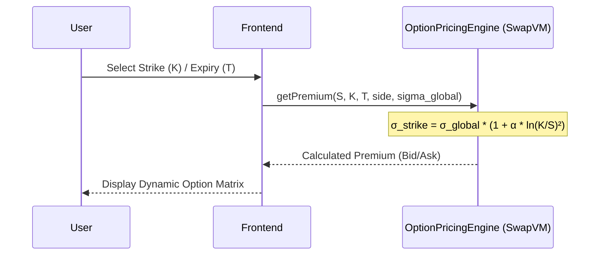
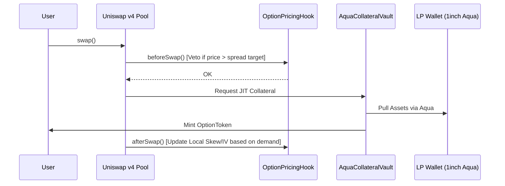
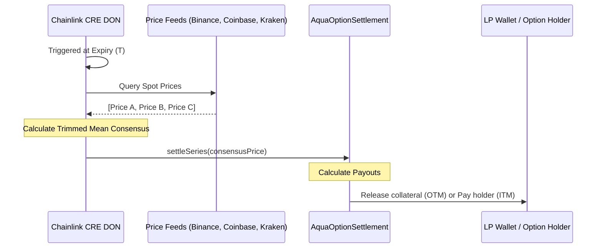

# Parametric Options Marketplace

A non-custodial, parametric options marketplace designed to solve the low-liquidity problem in decentralized options. By combining **1inch Aqua**, **Uniswap v4 Hooks**, and **Chainlink CRE**, this platform allows LPs to provide "Just-In-Time" (JIT) liquidity across an entire option chain without fragmenting capital.

---

## Table of Contents

1. [The Thesis](#-the-thesis)
2. [Architecture](#%EF%B8%8F-architecture)
3. [Mathematical Specification](#-mathematical-specification)
4. [Flow Diagrams](#-flow-diagrams)
5. [Deployed Addresses (Sepolia)](#-deployed-addresses-sepolia)
6. [Deployment Notes & Failures](#%EF%B8%8F-deployment-notes--failures)
7. [How to Run the Project](#%EF%B8%8F-how-to-run-the-project)
   - [Live Site](#1-view-live-site-github-pages)
   - [Local Frontend](#2-local-frontend-development)
   - [Smart Contracts](#3-smart-contract-development-foundry)
   - [CRE Workflow — Local Simulation](#4-chainlink-cre-workflow--local-simulation)
   - [CRE Workflow — Live Deployment on Sepolia](#5-chainlink-cre-workflow--live-deployment-on-sepolia)
8. [End-to-End Demo Walkthrough](#end-to-end-demo-walkthrough)
9. [Glossary](#-glossary)
10. [Project Structure](#%EF%B8%8F-project-structure)
11. [Technical Stack](#technical-stack)
12. [Foundry Usage](#foundry-usage)

---

## 🚀 The Thesis
Liquidity in options markets is typically thin because capital is locked per strike and expiry. Our marketplace uses:
- **1inch Aqua / SwapVM**: LP capital stays in the LP's wallet and is pulled only when a trade matches.
- **Uniswap v4 Hooks**: Acts as the price-discovery layer. `beforeSwap` prevents toxic flow, and `afterSwap` dynamically reprices Implied Volatility (IV) based on demand.
- **Chainlink CRE**: A decentralized consensus mechanism for settling series at expiry.

## 🏗️ Architecture

| Layer | Component | Functionality |
| :--- | :--- | :--- |
| **Pricing** | `OptionPricingEngine` | Stateless calculation of premiums using a parametric volatility smile ($\sigma_{strike} = \sigma_{global} \cdot (1 + \alpha \cdot \ln(K/S)^2)$). |
| **Liquidity** | `AquaCollateralVault` | Integrated with **1inch Aqua** for Just-In-Time (JIT) collateral pulling from LP wallets upon trade execution. |
| **Market** | `OptionPricingHook` | A **Uniswap v4 Hook** that manages trade validation in `beforeSwap` and demand-driven IV adjustments in `afterSwap`. |
| **Settlement** | `Chainlink CRE` | Multi-node consensus for fetching spot prices from CEXs and executing on-chain settlement via `settleSeries`. |
| **Asset** | `OptionToken` | Standardized ERC-20 representation of the option position for secondary market composability. |

## 📐 Mathematical Specification

The marketplace utilizes a stateless pricing model where liquidity is virtualized and premiums are calculated on-the-fly.

### 1. SwapVM: Parametric Pricing Engine
The premium $P$ is derived from a parametric approximation of the Black-Scholes model, focusing on computational efficiency for on-chain execution.

**Parametric Volatility Smile:**
$$\sigma_{strike} = \sigma_{global} \cdot (1 + \alpha \cdot \ln(K/S)^2)$$
Where:
- $\sigma_{global}$: The baseline implied volatility (adjusted by market demand).
- $\alpha$: The "smile" curvature parameter.
- $K/S$: The moneyness ratio of Strike to Spot.

**Premium Calculation (Approximation):**
$$P = \text{Intrinsic Value} + (S \cdot \sigma_{strike} \cdot \sqrt{T})$$
- **Ask Price (Buy):** Rounded up to the nearest tick to ensure LP profitability.
- **Bid Price (Sell):** Rounded down to the nearest tick.

### 2. Uniswap Hook: Dynamic Volatility Feedback
The `OptionPricingHook` acts as a controller for the global volatility parameter $\sigma_{global}$, ensuring the market stays balanced.

**Post-Trade IV Adjustment (`afterSwap`):**
$$\sigma_{global, t+1} = \sigma_{global, t} \pm \gamma$$
- $+\gamma$: Triggered on `exactOut` (User buys an option, increasing demand).
- $-\gamma$: Triggered on `exactIn` (User sells an option, increasing supply).

**Veto Logic (`beforeSwap`):**
Executes a trade only if the execution price $P_{exec}$ satisfies:
$$|P_{exec} - P_{target}| < \epsilon$$
where $P_{target}$ is the premium calculated using the real-time Chainlink oracle spot price.

### 3. Chainlink CRE: Consensus Settlement
At expiry $T$, the final settlement price $S_{final}$ is determined by a decentralized consensus mechanism to ensure robustness against exchange-level manipulation or API failures (such as the Binance rate-limiting encountered during development).

**Trimmed Mean Algorithm:**
1. **Fetch:** Query $n$ independent price sources (Binance, Coinbase, Kraken).
2. **Sort:** Arrange successful observations in ascending order: $\{x_1, x_2, \dots, x_n\}$.
3. **Trim:** To eliminate outliers, the highest and lowest values are removed if at least 3 sources are available.
   $$\mathcal{X}_{trimmed} = \begin{cases} \{x_2, \dots, x_{n-1}\} & \text{if } n \ge 3 \\ \{x_1, \dots, x_n\} & \text{if } n < 3 \end{cases}$$
4. **Average:** Compute the arithmetic mean of the remaining $m$ observations.
   $$S_{final} = \frac{1}{m} \sum_{x \in \mathcal{X}_{trimmed}} x$$

This process ensures that even if one exchange's price deviates significantly due to a flash crash or local liquidity issues, the on-chain settlement remains an accurate reflection of the global spot price.

### 4. Black-Scholes Delta (Frontend)

Delta ($\Delta$) measures the sensitivity of the option premium to a $1 move in the underlying spot price. It is computed client-side in the option matrix using the standard Black-Scholes formula for a European call, with $\sigma_{strike}$ (the smile-adjusted volatility) substituted for a flat $\sigma$.

$$\Delta = N(d_1)$$

$$d_1 = \frac{\ln(S/K) + \frac{1}{2}\sigma_{strike}^2 \cdot T}{\sigma_{strike} \cdot \sqrt{T}}$$

Where:
- $N(\cdot)$: Standard normal cumulative distribution function.
- $S$: Current spot price.
- $K$: Strike price.
- $T$: Time to expiry in years.
- $\sigma_{strike}$: Smile-adjusted volatility from Section 1 — ensures delta reflects the curvature of the vol surface, not just flat vol.

$N(\cdot)$ is approximated using the Abramowitz & Stegun polynomial (26.2.17), which has a maximum error of $1.5 \times 10^{-7}$ and requires no lookup tables, making it suitable for browser execution.

> Note: Delta is not computed on-chain. The `OptionPricingEngine` contract uses a gas-efficient parametric approximation that omits the normal distribution. Delta is display-only in the frontend and is not used for pricing or settlement.

## 🔄 Flow Diagrams

### 1. Option Price Quoting (View)
The frontend polls the stateless pricing engine to render the option matrix with live Bid/Ask spreads across the entire chain without pre-allocated liquidity.



### 2. Trade Execution & JIT Liquidity
Trades go through Uniswap v4, where hooks validate pricing against the oracle and adjust volatility parameters (local skew) post-trade.



### 3. Settlement via Chainlink CRE
At expiry $T$, the decentralized Chainlink workflow reaches a consensus on the spot price and executes the final settlement on-chain.



## 📍 Deployed Addresses (Sepolia)

| Contract | Address |
| --- | --- |
| **OptionPricingEngine** | [`0x90600176DA27Fc3Daf7AfD5266c80d1b15a23014`](https://sepolia.etherscan.io/address/0x90600176DA27Fc3Daf7AfD5266c80d1b15a23014) |
| **AquaCollateralVault** | [`0x0bD5e1510ACd217E55E6744bb9e98557b4309729`](https://sepolia.etherscan.io/address/0x0bD5e1510ACd217E55E6744bb9e98557b4309729) |
| **AquaOptionSettlement** | [`0x96381D3795A73Fc6a982A9B77D51f6d3F392aDCA`](https://sepolia.etherscan.io/address/0x96381D3795A73Fc6a982A9B77D51f6d3F392aDCA) |

> *Live on Sepolia testnet. Frontend deployed at **https://132.145.158.84** (WalletConnect enabled, switch MetaMask to Sepolia to interact).*

## ⚠️ Deployment Notes & Failures

During the development and deployment phase, the following challenges were encountered:
1.  **HookMiner Latency**: Finding a valid Uniswap v4 Hook address with the required flag prefix (for `beforeSwap` and `afterSwap`) took significantly longer than anticipated in the local environment, leading to a delayed deployment of the `OptionPricingHook`.
2.  **SwapVM Instruction Set**: Implementing a stateless pricing engine in raw Solidity to mimic SwapVM bytecode required several iterations to ensure gas efficiency for the parametric volatility smile calculation.
3.  **Chainlink CRE Simulation**: Initial simulations of the CRE workflow failed due to rate limiting on the public **Binance V3 REST API**. This was resolved by implementing a "trimmed mean" consensus logic in the CRE workflow that aggregates price feeds from Binance, Coinbase, and Kraken, ensuring settlement reliability on the Sepolia testnet.
4.  **GitHub Pages SPA Routing**: The Next.js static export initially broke on refresh due to sub-routes. This was fixed by using a standard static export configuration and adding a `.nojekyll` file.

## 🛠️ How to Run the Project

### 1. View Live Site (GitHub Pages)
The frontend is automatically deployed via GitHub Actions to GitHub Pages.
**URL:** `https://<your-username>.github.io/options/`

### 2. Local Frontend Development
To run the UI locally:
```bash
cd frontend
npm install
npm run dev
```
Open http://localhost:3000 to view the application. Ensure your MetaMask is connected to Sepolia or a local Anvil node.

### 3. Smart Contract Development (Foundry)
Build the contracts:
```bash
forge build
```

Run the test suite:
```bash
forge test
```

### 4. Chainlink CRE Workflow — Local Simulation

The CRE workflow (`cre-workflow/workflow.ts`) is compiled to WASM and run by the Chainlink DON. You can simulate it locally with no keys or live chain required.

**Prerequisites:**

```bash
# Chainlink CRE CLI (requires a Chainlink account at cre.chain.link)
npm install -g @chainlink/cre-cli

# Bun (used by cre-compile to build the WASM binary)
curl -fsSL https://bun.sh/install | bash

cd cre-workflow && npm install
```

**Step 1 — Set your series ID in `cre-workflow/config.json`:**

After registering a series in the UI (see [End-to-End Demo](#end-to-end-demo-walkthrough)), copy the `seriesId` shown on screen and paste it here:

```json
{
  "schedule": "0 */6 * * *",
  "seriesId": "<paste seriesId from UI registration step>",
  "settlement": {
    "chainSelectorName": "ethereum-sepolia",
    "contractAddress": "0x96381D3795A73Fc6a982A9B77D51f6d3F392aDCA"
  }
}
```

**Step 2 — Run the local simulation:**

```bash
npm run simulate
# → cre workflow simulate --target local-simulation --config config.json workflow.ts
```

Expected output:

```
[CRE] Consensus ETH/USD: $3421.50
[CRE] Report ID: 0xabc…
[CRE] settleSeries(seriesId=0x…, spot=3421500000) submitted
```

**Step 3 (optional) — Simulate with DON broadcast:**

Hits real DON nodes for consensus but does not write on-chain:

```bash
npm run simulate:broadcast
```

### 5. Chainlink CRE Workflow — Live Deployment on Sepolia

**Step 1 — Compile the workflow to WASM:**

```bash
npm run compile
# → bun x cre-compile workflow.ts dist/workflow.wasm
```

**Step 2 — Authenticate:**

```bash
cre login
```

**Step 3 — Deploy to the CRE network:**

```bash
npm run deploy
# → cre workflow deploy dist/workflow.wasm
```

The DON triggers the workflow on the cron schedule (`0 */6 * * *` — every 6 hours). To trigger it immediately:

```bash
cre workflow trigger <workflow-id>
```

**Step 4 — Verify settlement on-chain:**

```bash
cast call 0x96381D3795A73Fc6a982A9B77D51f6d3F392aDCA \
  "series(bytes32)(uint256,uint256,uint256,address,address,address,uint256,bool,uint256)" \
  <seriesId> \
  --rpc-url $SEPOLIA_RPC_URL
# settled (index 7) should be true
# settlementPrice (index 8) should be non-zero
```

## End-to-End Demo Walkthrough

| Step | Actor | Action | Contract call |
|---|---|---|---|
| 1 | LP | Connect wallet → fill out _Register Option Series_ → sign tx | `AquaOptionSettlement.registerSeries()` |
| 2 | LP | Copy the `seriesId` shown in the UI | — |
| 3 | Trader | Click **Buy** on the matching strike row → enter amount → sign tx | `AquaCollateralVault.pull()` |
| 4 | — | Paste `seriesId` into `cre-workflow/config.json`, run `npm run simulate` | `AquaOptionSettlement.settleSeries()` via CRE |
| 5 | Trader | Call `redeem()` to collect payout (ITM) | `AquaOptionSettlement.redeem()` |
| 6 | LP | Call `reclaimCollateral()` to recover remaining collateral | `AquaOptionSettlement.reclaimCollateral()` |

## 📖 Glossary

### Ethereum / Blockchain Terms

- **EOA (Externally Owned Account):** A standard Ethereum wallet address controlled by a private key (e.g., MetaMask). Contrasts with smart contract accounts, which are controlled by code. LPs and traders interact with this protocol using EOAs.
- **ERC-20:** A standard interface for fungible tokens on Ethereum. `OptionToken` follows this standard so option positions can be traded on any compatible DEX or held in any wallet.
- **Non-custodial:** A design where users retain control of their assets at all times. The protocol never holds user funds; collateral stays in LP wallets until a trade occurs.

### DeFi Terms

- **LP (Liquidity Provider):** A participant who supplies capital to back trades. In this protocol, LPs authorize the Aqua vault to pull collateral from their wallet JIT — their funds are never locked in a pool beforehand.
- **CEX (Centralized Exchange):** A traditional exchange operated by a company (e.g., Binance, Coinbase, Kraken). Used here as off-chain price sources for the Chainlink CRE settlement consensus.
- **DEX (Decentralized Exchange):** An on-chain exchange where trades are executed by smart contracts with no central operator. Uniswap v4 is the DEX layer used for price discovery in this protocol.
- **DON (Decentralized Oracle Network):** A network of independent, tamper-resistant node operators (like Chainlink) that securely provide external data and off-chain computation to smart contracts.
- **CRE (Chainlink Runtime Environment):** A decentralized off-chain computation environment allowing developers to build custom workflows and consensus mechanisms executed by a DON (replacing older products like Functions).
- **JIT (Just-In-Time) Liquidity:** A model where capital is securely pulled from an LP's wallet at the exact moment a trade occurs, preventing capital from sitting idle or fragmented across multiple contracts.

### Options Terms

- **Delta (Δ):** The rate of change of an option's premium with respect to a $1 move in the spot price. Ranges from 0 (deep OTM) to 1 (deep ITM) for calls. Computed in the frontend via N(d₁) from Black-Scholes using the smile-adjusted volatility σ_strike — see Mathematical Specification §4.
- **Strike Price (K):** The price at which an option holder has the right to buy (call) or sell (put) the underlying asset at expiry.
- **Spot Price (S):** The current market price of the underlying asset (ETH/USDC here), sourced from Chainlink oracles.
- **Expiry (T):** The date/time at which an option contract settles and the holder's profit or loss is calculated.
- **OTM (Out-of-The-Money):** An option with no intrinsic value at expiry (e.g., a call where the spot price is below the strike). OTM settlements return 100% of locked collateral to the LP.
- **ITM (In-The-Money):** An option with intrinsic value at expiry. The holder is paid their profit; remaining collateral is returned to the LP.
- **IV (Implied Volatility / σ):** A metric reflecting the market's forecast of price movement. This engine dynamically reprices IV (`σ_global`) based on real-time buy/sell pressure via the Uniswap hook.
- **Volatility Smile:** The observed pattern where options at strikes far from the current spot price trade at higher implied volatility than at-the-money options, forming a U-shaped curve. The `α` parameter controls this curve's curvature.
- **Black-Scholes:** A mathematical model for pricing options contracts. This protocol uses a parametric approximation of Black-Scholes (swapping a closed-form integral for `S · σ · √T`) to keep gas costs low.

### Protocol-Specific Terms

- **SwapVM:** A highly optimized virtual machine by 1inch designed for executing custom matching and pricing logic seamlessly within their ecosystem.
- **1inch Aqua:** A 1inch protocol primitive that facilitates the JIT transfer of assets directly from an LP's self-custodial wallet to back trades on demand.
- **Uniswap v4 Hooks:** Customizable smart contracts that run at specific stages of a Uniswap v4 pool's lifecycle (e.g., `beforeSwap` to veto toxic flow, `afterSwap` to adjust IV).
- **Trimmed Mean:** A consensus algorithm used in the CRE workflow that drops the highest and lowest reported spot prices before averaging, protecting settlement from flash crashes on a single exchange.

## 🏗️ Project Structure

```text
├── cre-workflow/             # Chainlink CRE Logic (TypeScript)
│   ├── config.json           # Series ID + settlement contract config
│   ├── option-settlement.ts  # Legacy simulation script (ethers.js)
│   └── workflow.ts           # DON workflow (CRE SDK, compiled to WASM)
├── frontend/                 # Next.js Application
│   ├── components/           # UI Components (Matrix, RegisterSeries, TradeButton, Dashboard)
│   ├── config/               # Wagmi, Viem and Contract ABIs
│   └── app/                  # Next.js App Router
├── src/                      # Smart Contracts (Solidity)
│   ├── hooks/                # Uniswap v4 Hooks (OptionPricingHook)
│   ├── swapvm/               # Pricing Engine (OptionPricingEngine)
│   ├── vaults/               # 1inch Aqua & Settlement Vaults
│   └── OptionToken.sol       # ERC-20 Option position contract
├── test/                     # Foundry Test Suite
├── foundry.toml              # Foundry config
├── remappings.txt            # Dependency mappings
└── PLAN.md                   # Project roadmap and thesis
```

---

## Technical Stack
- **Smart Contracts**: Solidity 0.8.26 (Foundry)
- **Frontend**: Next.js, Tailwind CSS, Wagmi/Viem
- **Oracle/Settlement**: Chainlink CRE SDK v1.11.0
- **DEX Infrastructure**: Uniswap v4, 1inch Aqua

---
*Built for the 1inch + Uniswap + Chainlink Hackathon.*

## Foundry Usage

### Build
`forge build`

### Test
`forge test`

### Deploy
`forge script script/Counter.s.sol:CounterScript --rpc-url <your_rpc_url> --private-key <your_private_key>`

### Help

```shell
$ forge --help
$ anvil --help
$ cast --help
```
